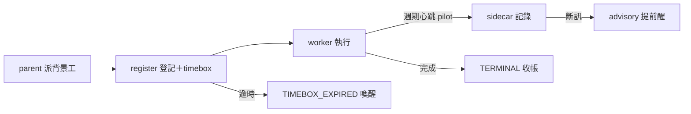
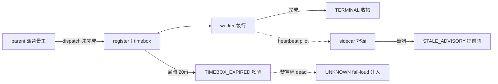

## Description

<!-- SECTION:DESCRIPTION:BEGIN -->
**這卡解什麼**：這兩天三起「派出去的 worker 無聲死亡」（bridge watcher 昨晚、SC-197 原 worker 靜默 2h10m、copy 研究員 143 分）共用同一個缺口——**派工之後沒有登記、沒有逾時、沒有人負責收帳**，全部靠人想起來才發現。本卡把監督變成派工的必要步驟：背景工派出去必須登記（誰監督、多久逾時），逾時就大聲喚醒派工者；再加一層試點性的 child 心跳（worker 主動報平安）讓長工單的 stale 偵測更靈敏。

**不做什麼**：daemon 常駐行程、把檔案修改時間當心跳、通用層接管 bridge 心跳計算、role 內嵌完整協議（9 份漂移面）、SendMessage ping（契約未凍結，留空分支）。

**pilot 邊界**：child 心跳只在 impl-lite＋cr-research 兩個長工 role 試行；forget 率<20% 且至少一次真實提前喚醒，才擴散其他 roles。

〔已決策勿重辯〕①invariant：背景＋有限工 dispatch ⇒ collection owner 建立；三出口 TERMINAL／HARD_DEATH_EVIDENCE／TIMEBOX_EXPIRED＋UNKNOWN fail-loud 升級（UNKNOWN 禁列結案態）；silence 可觀測、death 不可——禁逾時宣稱死亡②ownership 歸 parent：registration 與 collected 都 parent 專屬③刪互動短腿豁免（僅前景 <30s probe 與已登記 ownership handle 的 daemon 豁免）④hooks＝reconciliation trigger 非 detector⑤台帳分家：bridge liveness.jsonl 不動；child 寫自己的 sidecar；worker-supervision/1 投影按需⑥heartbeat 永不覆蓋 timebox／terminal；stale 恆 advisory⑦SendMessage ping contract 未凍結留空分支⑧溯源：codex job-muc59d94＋muse job-muc5k1pi＋agents-watcher 雙腿 job-muc5znvd/muc5znwb。開工時依 card Planning Contract 補 AC/Plan。
<!-- SECTION:DESCRIPTION:END -->

## Acceptance Criteria
<!-- AC:BEGIN -->
- [ ] #1 agent-workflow 收緊條文在場（rg 可查）：背景＋有限工 dispatch⇒register 義務；互動短腿豁免已刪；前景 <30s probe 豁免明文
- [ ] #2 supervision contract 凍結文件在場：三出口＋UNKNOWN fail-loud 升級＋偵測/處置分離＋heartbeat 缺席合法＋偽造禁令（fresh 不延 timebox、stale 不判死）
- [ ] #3 impl-lite 與 cr-research 兩 role 各一行 pointer 在場；cr-research 的 read-only 側通道豁免明文；sync_agents.py --map 生成物同步
- [ ] #4 scripts/child_heartbeat.py＋unit test：atomic append sidecar（seq 遞增、emittedAt 由 helper 寫）覆蓋正常/半行/亂序 seq
- [ ] #5 harness_waiter sweep 加 sidecar 讀面：expectedHeartbeat=true 缺席超 2×interval→heartbeat_missing telemetry 降 L0；新鮮→壓 advisory 不延 timebox——test 覆蓋
- [ ] #6 frozen spec 零變：harness_waiter 主體狀態機與 bridge 面不動；全套 pytest 綠
- [ ] #7 pilot 收斂判準記錄在卡 notes：forget 率<20%＋至少一次真實 stale 提前喚醒才擴散
<!-- AC:END -->

## Implementation Plan

<!-- SECTION:PLAN:BEGIN -->
〔Baseline〕①skills/agent-workflow/SKILL.md 形態分類：Task tool 背景 subagent＝強制 register、互動短腿豁免（事故破口）②scripts/harness_waiter.py：ZCode worker timebox supervisor（v2 pivot——metadata terminal 唯一權威＋generation mismatch＋silenceBudget 預設 20m；--register 寫 .agent-tmp/liveness-registry.json 原子替換）③scripts/bridge_waiter.py＋AIR-158 heartbeat 腿（air-158 branch，未進 main）④agents/roles/*.md 九個 role，sync_agents.py 僅投影 prompt body 無自動執行點⑤實證：SC-197 靜默 2h10m＋copy 研究員 143 分（皆未登記 subagent）、昨晚 bridge watcher 無聲死亡

〔已決策勿重辯〕①invariant：背景＋有限工 dispatch ⇒ collection owner 建立；三出口 TERMINAL／HARD_DEATH_EVIDENCE／TIMEBOX_EXPIRED＋UNKNOWN fail-loud 升級（禁列結案態）；silence 可觀測 death 不可——禁逾時宣稱死亡②ownership 歸 parent：registration 與 collected 都 parent 專屬③刪互動短腿豁免（僅前景 <30s probe 與已登記 ownership handle 的 daemon 豁免）④hooks＝reconciliation trigger 非 detector⑤台帳分家：bridge liveness.jsonl 不動；child 寫自己的 sidecar；worker-supervision/1 投影按需⑥heartbeat 永不覆蓋 timebox／terminal；stale 恆 advisory⑦SendMessage ping contract 未凍結留空分支⑧child 禁寫 parent registry／禁自報 collected

〔Scope〕動——skills/agent-workflow/SKILL.md（收緊條文＋刪豁免＋canonical heartbeat 協議節）；agents/roles/impl-lite.md＋agents/roles/cr-research.md（各一行 pointer＋read-only 側通道豁免明文）；scripts/harness_waiter.py（加 sidecar 讀面為 advisory 輸入＋expectedHeartbeat 欄）；scripts/child_heartbeat.py（新——atomic append helper）；tests/。不動——bridge_waiter.py 與 liveness.jsonl、watcher_pairing_nag.py、liveness-registry.json 寫面併發模型、其餘 7 roles、presets.toml、sync_agents.py

〔Scenarios〕①背景 worker 正常完成→register＋terminal 銷帳②worker 無聲死亡→timebox 到期 TIMEBOX_EXPIRED→advisory 喚醒 parent（禁宣稱 dead）③heartbeat 新鮮但工未完→alive-quiet 續等（壓 advisory 不延 timebox）④expectedHeartbeat=true 缺席超 2×interval→降 L0＋heartbeat_missing telemetry⑤read-only role→sidecar 寫入＝監督遙測非產物寫入（豁免明文）⑥registry 檔損壞→UNKNOWN fail-loud

〔Integration〕下游＝harness_waiter sweep（advisory 輸入）、AIR-158 bridge 分態（語義對齊）、SC-201（adapter 骨架/ping 矩陣/投影——本卡不做）、deep-work 與各 execution flow（spawn 義務生效面）

〔驗證式〕見 AC。
<!-- SECTION:PLAN:END -->

## Final Summary

<!-- SECTION:FINAL_SUMMARY:BEGIN -->
worker 派工監督契約落地：agent-workflow 收緊（背景＋有限工 dispatch ⇒ register 義務，刪互動短腿豁免）＋supervision contract 凍結節（三出口＋UNKNOWN fail-loud＋偵測/處置分離＋偽造禁令）＋child_heartbeat.py sidecar（pilot：impl-lite＋cr-research）＋harness_waiter expectedHeartbeat 讀面＋register 三面對稱（agent_ 前綴）。dogfood 實戰：本卡自身的併發衝突仲裁與 register 拒收即契約活教材。全套 1396 passed；frozen spec T1-T9 零變。codex/muse 雙審＋996b1658 驗收。pilot 收斂判準（forget 率<20%＋真實提前喚醒）dogfood 中，達標才擴散其餘 roles。

<!-- SECTION:FINAL_SUMMARY:END -->
