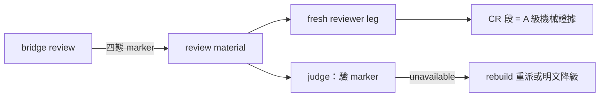
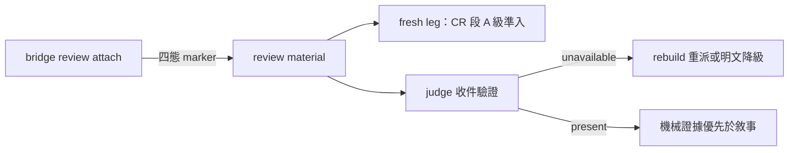

## Description

<!-- SECTION:DESCRIPTION:BEGIN -->
**這卡解什麼**：delegate-bridge 2.0.26 給 review 流程加了 code-reality 證據面（review 時自動附掛 graph-checked 機械證據，四態 marker：[cr:present]/[cr:empty]/[cr:unavailable]/[cr:skipped]，降級不擋）。我方的 review 消費面（review-engine、judge、role 描述）還不知道怎麼吃這個新證據。本卡把消費面補齊：五處小改，讓 CR 證據從「送到了」變「被正確消費」。

**不做什麼**：bridge 側任何改動（evidence attach 已由 bridge 2.0.26 出貨，freshness/建 index 也不歸 bridge）；sc-router 側；CR 工具本體。

**五個改動點**（對應 bridge 線討論題）：
1. reviewer-brief 消費指引：bridge reviewer-brief-template 加 CR 段說明（bridge repo 面，該側自有卡）；我方 review-engine 同步 judge 指引——CR 段＝A 級機械證據（graph-checked），優先於敘事宣稱
2. 反錨定放行：fresh leg 的排除清單（EP 結論/receipts 敘事）明文不含 CR 機械證據——準入，寫進 review-engine 證據分類
3. 收件驗證：judge/收線時驗四態 marker；[cr:unavailable] → rebuild index 重派或明文接受降級，禁靜默吞
4. 新鮮度前置：review dispatch 流程加 index freshness 檢查小步（arc 大幅動檔後先 rebuild）
5. agents 面：code-reviewer/cr-research role 描述補一句「bridge review material 可能含 CR evidence 段」及其證據地位

〔已決策勿重辯〕①五題表態已回 bridge 線（command_id 1233f3d9，sc-2014 對話）②CR 段＝A 級機械證據準入 fresh leg；bridge 永不碰 CR write-face（build/snapshot 歸 harness 互動面）③降級四態不擋 review④溯源：sess_64d6fbf9 通知（message 收訖於本 session）＋bridge 2.0.26 DB-23 Done。開工時依 card Planning Contract 補 AC/Plan。
<!-- SECTION:DESCRIPTION:END -->

## Acceptance Criteria
<!-- AC:BEGIN -->
- [ ] #1 review-engine SKILL 補 CR 證據分類與四態 marker 消費指引（rg 可查）
- [ ] #2 fresh leg 排除清單明文不含 CR 機械證據（放行條文在場）
- [ ] #3 judge 流程含 marker 驗證步驟（[cr:unavailable] 兩態處置：rebuild 重派或明文降級）
- [ ] #4 code-reviewer 與 cr-research 兩 role 描述各補 CR 段證據地位一句
- [ ] #5 全套 pytest 綠零退化（docs 變更）
<!-- AC:END -->

## Implementation Plan

<!-- SECTION:PLAN:BEGIN -->
〔Baseline〕①skills/review-engine/SKILL.md 證據分類現況無 CR 證據面②bridge 2.0.26 DB-23 出貨：review --base 自動附掛 CR 機械證據（四態 marker [cr:present]/[cr:empty]/[cr:unavailable]/[cr:skipped]、bounded 8000B、降級不擋）③agents/roles/code-reviewer.md＋cr-research.md 無 CR 段認知④bridge 線討論題五條（sess_64d6fbf9 通知）。

〔已決策勿重辯〕①CR 段＝A 級機械證據（graph-checked 非敘事非 marshal 篩選）準入 fresh leg②judge 驗四態 marker；[cr:unavailable]→rebuild 重派或明文降級，禁靜默③新鮮度檢查＝review dispatch 前置步驟（bridge 不管 freshness 分工正確）④bridge 側 reviewer-brief template 歸 bridge repo（非本卡）⑤溯源：sess_64d6fbf9 通知＋bridge 2.0.26 DB-23＋回信 1233f3d9。

〔Scope〕動——skills/review-engine/SKILL.md（CR 證據分類＋judge marker 驗證＋新鮮度前置）、agents/roles/code-reviewer.md＋cr-research.md（各一句 CR 段證據地位）。不動——bridge repo、agent-workflow（AIR-160 剛收線）、sc-router、presets.toml。

〔Scenarios〕①review material 含 [cr:present]→CR 段被 fresh leg 消費為 A 級證據②[cr:unavailable]→judge 裁決 rebuild 重派或明文降級③[cr:skipped]/[cr:empty]→如實記錄不誤判。

〔驗證式〕見 AC。
<!-- SECTION:PLAN:END -->

## Final Summary

<!-- SECTION:FINAL_SUMMARY:BEGIN -->
review 消費面接 bridge CR 證據落地：review-engine 新節（CR 段＝A 級機械證據準入 fresh leg＋四態 marker 消費表＋judge 收件驗證 fail-closed）＋agent-review-cycle 執行指針＋code-reviewer/cr-research 兩 role 證據地位補句＋投影同步。docs 卡全套 1496 綠。bridge 線五題表態已回（不開 bi）。改動點 4（index freshness 前置檢查）歸後續——隨 review dispatch workflow 段落處理。bridge 側 reviewer-brief-template 歸 bridge repo 自有卡。

<!-- SECTION:FINAL_SUMMARY:END -->
