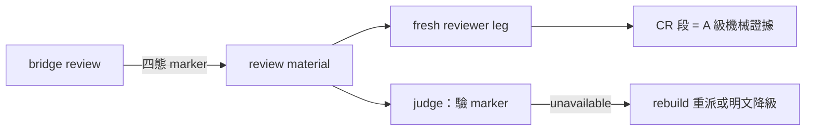

## Description

<!-- SECTION:DESCRIPTION:BEGIN -->
**這卡解什麼**：delegate-bridge 2.0.26 給 review 流程加了 code-reality 證據面（review 時自動附掛 graph-checked 機械證據，四態 marker：[cr:present]/[cr:empty]/[cr:unavailable]/[cr:skipped]，降級不擋）。我方的 review 消費面（review-engine、judge、role 描述）還不知道怎麼吃這個新證據。本卡把消費面補齊：五處小改，讓 CR 證據從「送到了」變「被正確消費」。

**不做什麼**：bridge 側任何改動（evidence attach 已由 bridge 2.0.26 出貨，freshness/建 index 也不歸 bridge）；sc-router 側；CR 工具本體。

**五個改動點**（對應 bridge 線討論題）：
1. reviewer-brief 消費指引：bridge reviewer-brief-template 加 CR 段說明（bridge repo 面，該側自有卡）；我方 review-engine 同步 judge 指引——CR 段＝A 級機械證據（graph-checked），優先於敘事宣稱
2. 反錨定放行：fresh leg 的排除清單（EP 結論/receipts 敘事）明文不含 CR 機械證據——準入，寫進 review-engine 證據分類
3. 收件驗證：judge/收線時驗四態 marker；[cr:unavailable] → rebuild index 重派或明文接受降級，禁靜默吞
4. 新鮮度前置：review dispatch 流程加 index freshness 檢查小步（arc 大幅動檔後先 rebuild）
5. agents 面：code-reviewer/cr-research role 描述補一句「bridge review material 可能含 CR evidence 段」及其證據地位

〔已決策勿重辯〕①五題表態已回 bridge 線（command_id 1233f3d9，sc-2014 對話）②CR 段＝A 級機械證據準入 fresh leg；bridge 永不碰 CR write-face（build/snapshot 歸 harness 互動面）③降級四態不擋 review④溯源：sess_64d6fbf9 通知（message 收訖於本 session）＋bridge 2.0.26 DB-23 Done。開工時依 card Planning Contract 補 AC/Plan。
<!-- SECTION:DESCRIPTION:END -->
