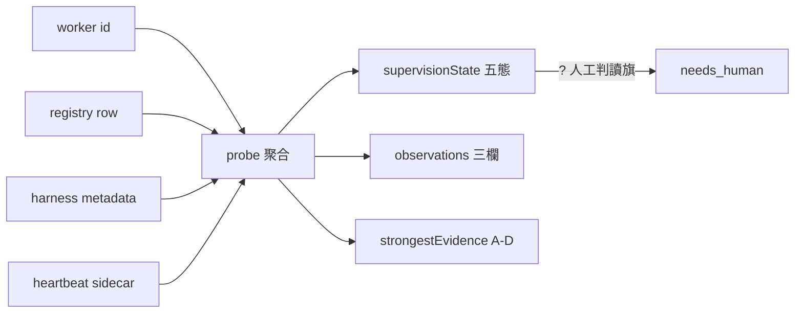
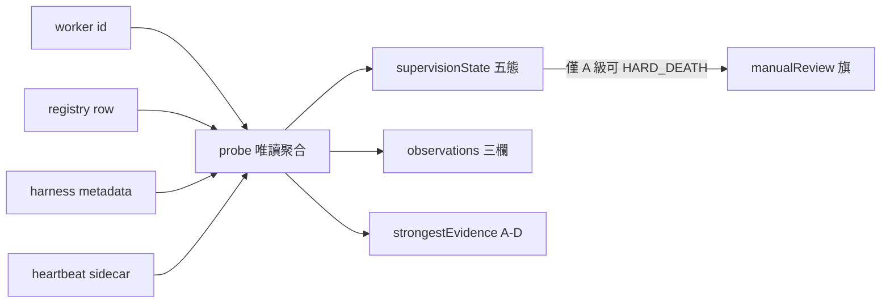

## Description

<!-- SECTION:DESCRIPTION:BEGIN -->
**這卡解什麼**：今天 marshal 把活 worker 判成死的（無 output 檔→判死→雙重派工→併發衝突），暴露偵測面沒有機械程序——臨場即興（output mtime＋ping＋diff 增長）無證據分級。雙腿設計（codex＋muse 已收斂）落地：**supervision probe**——輸入 worker id，聚合 registry row／harness metadata／heartbeat sidecar／ping 可達性，輸出分離兩軸（supervisionState＋observations）＋證據分級（A/B/C/D）＋人工判讀旗標；搭配 **ping 五態真機矩陣**凍結 ping 的正式語義。

**不做什麼**：daemon 常駐、ping 當死亡 oracle（矩陣凍結前僅 reachability）、mtime 當 heartbeat、跨台帳（bridge liveness.jsonl）合併、第二份死亡語義實作（probe 宿主＝harness_waiter mode）。

**已決策**（雙腿收斂）：死亡宣稱僅 A 級證據（terminal metadata／generation mismatch）；D 級（output 缺席／transcript mtime／ping 不在冊）永不支撐死亡；WT 活動須 attempt 身分窗綁定否則 attribution_ambiguous；SendMessage＝mutating probe 矩陣用 sacrificial workers；「wake early, declare death late——B/C/D 可喚醒，僅 A 可 HARD_DEATH，重派前 fresh probe＋fence」。

〔已決策勿重辯〕①probe 輸出分離兩軸（supervisionState ≠ observations）②死亡宣稱僅 A 級③D 級永不支撐死亡④身分窗綁定⑤SendMessage＝mutating probe 用 sacrificial workers⑥宿主＝harness_waiter probe mode（避免第二份死亡語義實作；codex 腿論證）⑦wake early declare death late⑧溯源：detection-codex-result.md＋detection-muse-result.md＋今日事故鏈。開工時依 card Planning Contract 補 AC/Plan。
<!-- SECTION:DESCRIPTION:END -->

## Acceptance Criteria
<!-- AC:BEGIN -->
- [ ] #1 probe mode＋unit tests（五態輸出＋observations 三欄＋A-D 分級＋manualReview 旗）
- [ ] #2 ping 五態矩陣真機執行（sacrificial workers×5 態×TaskOutput/SendMessage）＋記錄表落檔
- [ ] #3 contract 偵測節吸收矩陣結論（可機械區分或誠實不可區分——兩者皆可驗收）
- [ ] #4 全套 pytest 綠
<!-- AC:END -->

## Implementation Plan

<!-- SECTION:PLAN:BEGIN -->
〔Baseline〕①scripts/harness_waiter.py（AIR-160 probe 讀面基礎）②今日死亡誤判事故鏈（register 拒收 agent_ 前綴→output 檔啟發式→活 worker 判死→雙重派工→併發衝突）③雙腿設計收斂 detection-codex/muse-result.md。

〔已決策勿重辯〕①probe 輸出分離兩軸：supervisionState（TERMINAL/HARD_DEATH/TIMEBOX/MONITORED/UNKNOWN）＋observations（recentExecution/addressable/workspaceActivity）＋strongestEvidence A-D＋manualReview 旗②死亡宣稱僅 A 級（terminal metadata/generation mismatch）③D 級（output 缺席/transcript mtime/ping 不在冊）永不支撐死亡④WT 活動須 attempt 身分窗綁定否則 attribution_ambiguous⑤SendMessage＝mutating probe 矩陣用 sacrificial workers⑥宿主＝harness_waiter probe mode⑦wake early declare death late——重派前 fresh probe＋fence。

〔Scope〕動——scripts/harness_waiter.py（probe mode 唯讀聚合）、scripts/（ping 矩陣實驗腳本）、tests/。不動——bridge、liveness.jsonl 語義、T1-T9 frozen 主體。

〔Scenarios〕①running→MONITORED②真死→HARD_DEATH_EVIDENCE③timebox→TIMEBOX_EXPIRED（不宣稱 dead）④無法判定→UNKNOWN fail-loud。

〔驗證式〕見 AC。
<!-- SECTION:PLAN:END -->

## Final Summary

<!-- SECTION:FINAL_SUMMARY:BEGIN -->
worker 存活偵測 probe 落地：harness_waiter --probe mode（唯讀聚合 registry/heartbeat/workspace/metadata → supervisionState 五態＋observations 三欄＋strongestEvidence A-D＋manualReview 旗；身分窗綁定 attribution_ambiguous 升 needs_human）＋ping_matrix.py 五態×六面真機矩陣（TaskOutput/SendMessage structurally-unavailable 誠實標注→H 級 corpus＋self-verified live 替代；live running 之 output ABSENT×lsof LEASE HELD＝今日事故的直接機器反證）。29 tests＋全套 1525 綠＋frozen numstat 368/0 零變。settlement F1 措辭收斂已修。殘餘：in-conversation ping 語義凍結（parent session sacrificial 實驗——nonce ACK 升 B 級）與矩陣穩定性輪次為後續卡；heartbeat 未設定 probe 之 recentExecution 恆 unknown（缺席合法）。

<!-- SECTION:FINAL_SUMMARY:END -->
