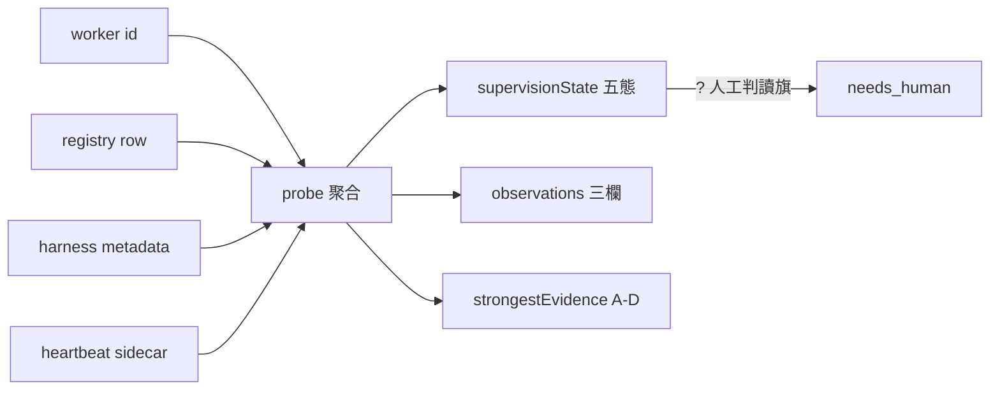

## Description

<!-- SECTION:DESCRIPTION:BEGIN -->
**這卡解什麼**：今天 marshal 把活 worker 判成死的（無 output 檔→判死→雙重派工→併發衝突），暴露偵測面沒有機械程序——臨場即興（output mtime＋ping＋diff 增長）無證據分級。雙腿設計（codex＋muse 已收斂）落地：**supervision probe**——輸入 worker id，聚合 registry row／harness metadata／heartbeat sidecar／ping 可達性，輸出分離兩軸（supervisionState＋observations）＋證據分級（A/B/C/D）＋人工判讀旗標；搭配 **ping 五態真機矩陣**凍結 ping 的正式語義。

**不做什麼**：daemon 常駐、ping 當死亡 oracle（矩陣凍結前僅 reachability）、mtime 當 heartbeat、跨台帳（bridge liveness.jsonl）合併、第二份死亡語義實作（probe 宿主＝harness_waiter mode）。

**已決策**（雙腿收斂）：死亡宣稱僅 A 級證據（terminal metadata／generation mismatch）；D 級（output 缺席／transcript mtime／ping 不在冊）永不支撐死亡；WT 活動須 attempt 身分窗綁定否則 attribution_ambiguous；SendMessage＝mutating probe 矩陣用 sacrificial workers；「wake early, declare death late——B/C/D 可喚醒，僅 A 可 HARD_DEATH，重派前 fresh probe＋fence」。

〔已決策勿重辯〕①probe 輸出分離兩軸（supervisionState ≠ observations）②死亡宣稱僅 A 級③D 級永不支撐死亡④身分窗綁定⑤SendMessage＝mutating probe 用 sacrificial workers⑥宿主＝harness_waiter probe mode（避免第二份死亡語義實作；codex 腿論證）⑦wake early declare death late⑧溯源：detection-codex-result.md＋detection-muse-result.md＋今日事故鏈。開工時依 card Planning Contract 補 AC/Plan。
<!-- SECTION:DESCRIPTION:END -->
