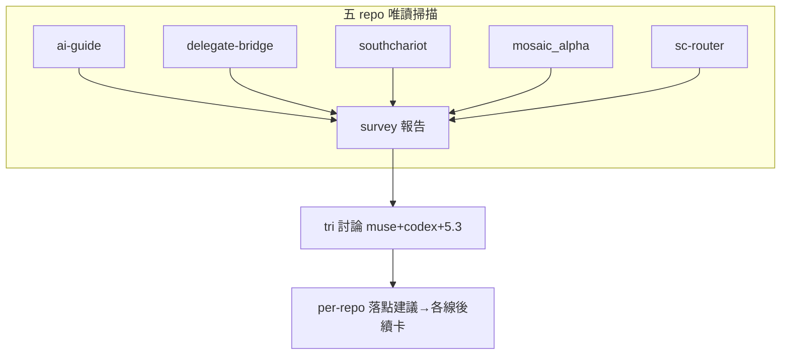

## Description

<!-- SECTION:DESCRIPTION:BEGIN -->
**這卡解什麼**：instruction 層／CR 的適配設計不該只看 ai-guide——五 repo（ai-guide／delegate-bridge／southchariot／mosaic_alpha／sc-router）各有不同性質（instruction repo／Rust+TS carrier／TS extension／量化交易／router），今天 SC 三層觸發＋「存在≠被用」三案證明：**沒有系統性盤點，每個 repo 都會各自長出（或漏掉）自己的 instruction 面與 CR 接線**。本卡＝盤點卡：三個 flash 分區掃五 repo，產出統一模板的 per-repo 適配矩陣，做為 tri（muse＋codex＋5.3）討論做法與後續 per-repo 落點卡的輸入。

**不做什麼**：五 repo 任何寫入（唯讀盤點；跨 repo 主權——落點變更歸各 repo 主權線後續卡）；不預設「每 repo 同做法」；不開 CR write-face；不結論先行的單一模板強套。

**盤點七維（統一模板）**：①目錄結構與機制面辨識（executable entry×跨 session 消費者）②instruction 覆蓋現況（AGENTS.md/CLAUDE.md/README per dir）③CR 現況（index 在場？language face？build 成本線索）④觸發點現況（開場 gate／init／close 接線）⑤盲點與漏想候選 ⑥建議草案（draft，tri 收斂用）⑦跨 repo 一致性 vs 特有性觀察

〔已決策勿重辯〕①盤點先行、tri 後落點（user 流程指示）②跨 repo 主權：盤點唯讀，落點建議 per-repo，變更歸各 repo 主權③sc-router 近端可及性待驗（不在則標 remote-only）④判準沿用 instruction-layer 雙腿收斂（MUST＝可執行入口被 workflow/control 面消費／bounded context 根；MUST NOT＝純產物鏡像）⑤溯源：user 指示＋instruction-layer 雙腿（job-muckhka6/muckhkbc）＋SC 三層觸發（AGENTS 7865e5d）＋「存在≠被用」三案。開工時依 card Planning Contract 補 AC/Plan。
<!-- SECTION:DESCRIPTION:END -->

## Acceptance Criteria
<!-- AC:BEGIN -->
- [ ] #1 三份 survey 報告覆蓋五 repo（統一七維模板）落 .agent-tmp/air-163-survey/
- [ ] #2 每 repo 的機制面目錄辨識有機械證據（rg/fd/ls 輸出引用）
- [ ] #3 CR 適用性判定（index 在場/face 支援/成本線索）逐 repo 記錄
- [ ] #4 盲點與漏想候選清單（跨 repo 匯總）
- [ ] #5 唯讀零寫入——五 repo git status 乾淨證據
<!-- AC:END -->

## Implementation Plan

<!-- SECTION:PLAN:BEGIN -->
〔Baseline〕五 repo 零系統性盤點；今日案例——ai-guide scripts/ 零 instruction 面（最重機制目錄）、southchariot root AGENTS.md only（13 一級目錄零模組面）、SC 三層觸發架構（AGENTS 7865e5d）、「存在≠被用」三案同日現形、bridge 2.0.26 review CR attach 已出貨（四態 marker）。

〔已決策勿重辯〕①盤點先行、tri 後落點（user 流程指示）②跨 repo 主權：盤點唯讀，落點建議 per-repo，變更歸各 repo 主權線③sc-router 近端可及性待驗（不在則標 remote-only）④判準沿用 instruction-layer 雙腿收斂（MUST＝可執行入口被 workflow/control 面消費／bounded context 根 ≥3 源碼；MUST NOT＝純產物鏡像）⑤溯源：instruction-layer-codex/muse-result.md＋SC 三層觸發＋user 指示。

〔Scope〕動——報告落 <WT>/.agent-tmp/air-163-survey/（三 worker 分區產出）。不動——五 repo 任何檔案（唯讀盤點）、backlog/、安裝面。

〔Scenarios〕①repo 在本機→全量盤點（七維模板）②repo 不在/遠端→remote-only 標記③語言 face 不支援→CR 適用性標記受限④目錄零覆蓋→如實記錄為 gap。

〔驗證式〕見 AC。
<!-- SECTION:PLAN:END -->
