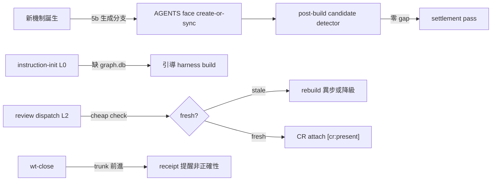

## Description

<!-- SECTION:DESCRIPTION:BEGIN -->
**這卡解什麼**：「存在≠被用」三案（code-reality 工具鏈在場沒人用／SC-199 規則有機制無／AIR-155 要人提醒才外部化）的根因修復——135 流程的 instruction 同步義務缺「生成面」（新機制誕生→instruction 真空），CR freshness 缺「消費前正確性 chokepoint」。雙腿＋bridge 既有機制合流後的落地設計：兩面補齊。

**不做什麼**：Planning Contract 第七欄／per-script AGENTS 全補／root 結構節膨脹／hook 自動 build／bridge 碰 write-face／instruction-sync --all 常駐／第二 inbox ledger／graph.db mtime 判 freshness。

**改動一：AGENTS.md coverage（生成面補齊）**
- implement 5b 加生成分支：新目錄/新可執行 → create-or-sync AGENTS face（predicate：可執行入口被 workflow/control 面消費、bounded context 根 ≥3 源碼、public contract）
- post-build 階段 4 加 candidate detector（機械 Detect→Extract→Delegate）
- scripts/AGENTS.md 新建（responsibility cluster 導航）＋governance/AGENTS.md 新建＋skills/CLAUDE.md 升 AGENTS source
- Planning Contract Scope/Integration 加 instruction surfaces 子欄
- ai-development-guide.md dependency-graph 角色行更新（CR 取代手繪依賴圖）

**改動二：CR freshness 分層**
- instruction-init L0：缺 .code-reality/graph.db → 引導 harness 面 build；build 失敗 → 明文降級收據禁全綠
- review-engine L2 dispatch preflight：cheap check（存在性＋identity 對照）同步；stale → rebuild 異步或明文降級——吸收 AIR-161 改動點 4
- wt-close 條件式提醒（trunk 前進 → receipt 提醒 marshal；非正確性依賴）

```mermaid
flowchart LR
  B[\"新機制誕生\"] -->|\"5b 生成分支\"| AG[\"AGENTS face create-or-sync\"]
  AG --> PB[\"post-build candidate detector\"]
  PB -->|\"零 gap\"| OK[\"settlement pass\"]
  II[\"instruction-init\"] -->|\"L0 缺 graph.db\"| HB[\"引導 harness build\"]
  RD[\"review dispatch\"] -->|\"L2 preflight\"| FC{\"fresh?\"}
  FC -->|\"stale\"| RB[\"rebuild 異步或降級\"]
  FC -->|\"fresh\"| OK
  WC[\"wt-close\"] -->|\"trunk 前進\"| RM[\"receipt 提醒非正確性\"]
```

〔已決策勿重辯〕①predicate 機械化：MUST＝(a) 跨 session 消費者契約可執行入口 (b) bounded context 根 ≥3 源碼 (c) public contract／控制面 authority；MUST NOT＝純產物鏡像；CONDITIONAL＝混住②implement 5b 加生成分支＋post-build 加 detector，不加第七欄③scripts/ 單檔 AGENTS（responsibility cluster）非 per-script④CR freshness＝source identity 非 graph.db mtime⑤bridge 永不碰 write-face⑥L2 禁阻塞式 rebuild（cheap check 同步＋rebuild 異步或降級）⑦wt-close 不自動 build（印提醒＋receipt，marshal 決策）⑧雙腿收斂溯源：instruction-layer-codex-result.md（8871B）＋instruction-layer-muse-result.md（7071B）＋bridge 線 post-build 三路徑確認。開工時依 card Planning Contract 補 AC/Plan。
<!-- SECTION:DESCRIPTION:END -->

## Acceptance Criteria
<!-- AC:BEGIN -->
- [ ] #1 agent-workflow 5b 生成分支在場（rg 可查）：新目錄/新可執行→create-or-sync AGENTS face 條文
- [ ] #2 post-build candidate detector 在場（ Detect→Extract→Delegate 形狀）
- [ ] #3 scripts/AGENTS.md 存在（responsibility cluster 導航）＋governance/AGENTS.md 存在
- [ ] #4 skills/AGENTS.md 存在（自 CLAUDE.md 升級）；CLAUDE.md 為 @wrapper
- [ ] #5 instruction-init L0 CR readiness 檢查在場（缺席→引導 build；失敗→明文降級收據）
- [ ] #6 review-engine L2 dispatch preflight 在場（cheap check；stale→rebuild 或降級）
- [ ] #7 wt-close 條件式提醒在場（trunk 前進→receipt 提醒）
- [ ] #8 ai-development-guide dependency-graph 角色行更新（CR 取代）
- [ ] #9 全套 pytest 綠零退化
<!-- AC:END -->

## Implementation Plan

<!-- SECTION:PLAN:BEGIN -->
〔Baseline〕①implement 5b reactive-only（從 diff 找既有 instruction 檔更新——新目錄空跳）②post-build 無 candidate detector③scripts/ 零 AGENTS④governance/ 零 AGENTS⑤skills/CLAUDE.md 無 AGENTS source⑥instruction-init 無 CR readiness⑦review-engine 無 dispatch preflight⑧wt-close 無 stale 提醒⑨ai-development-guide dependency-graph 角色行過時（CR 已取代手繪依賴圖）。

〔已決策勿重辯〕①predicate 三條可機械判（雙腿收斂）②流程插入 implement 5b 生成分支＋post-build candidate detector③不加第七欄④CR freshness 四層（L0 init bootstrap／L1 開工提醒既有／L2 dispatch preflight／L3 wt-close 條件式）⑤freshness＝source identity 非 mtime⑥bridge 永不碰 write-face⑦wt-close 不自動 build⑧不做清單：per-script AGENTS 全補/root 膨脹/第七欄/instruction-sync --all 常駐⑨溯源：instruction-layer 雙腿 job-muckhka6/muckhkbc＋bridge 線 post-build 三路徑確認＋AIR-161 改動點 4。

〔Scope〕動——skills/agent-workflow/SKILL.md（5b 生成分支＋偵測節已併）、skills/post-build/SKILL.md（candidate detector）、skills/instruction-init/SKILL.md（L0 CR readiness）、skills/review-engine/SKILL.md（L2 preflight）、scripts/wt-close.sh（條件式提醒）、scripts/AGENTS.md（新）、governance/AGENTS.md（新）、skills/AGENTS.md（新，自 CLAUDE.md 升級）、ai-development-guide.md（dependency-graph 角色行）、tests/。不動——bridge repo、sc-router、AIR-159 wt-sweep、compact-prep/handoff。

〔Scenarios〕①新目錄/新機制誕生→5b 生成分支觸發→create-or-sync AGENTS face②post-build detector 掃到 candidate→delegate 萃取③instruction-init 遇 graph.db 缺席→L0 引導 build 或明文降級④review dispatch stale→L2 preflight 攔（rebuild 或降級）⑤wt-close trunk 前進→receipt 提醒非正確性。

〔驗證式〕見 AC。
<!-- SECTION:PLAN:END -->

## Final Summary

<!-- SECTION:FINAL_SUMMARY:BEGIN -->
instruction 層觸發點落地（存在≠被用 根因修復）：改動一 AGENTS coverage 生成面——implement 5b 生成分支（predicate 機械化：可執行入口被消費/bounded 根 ≥3/public contract）＋post-build candidate detector（Detect→Extract→Delegate）＋scripts/governance/skills 三面 AGENTS＋Planning 子欄＋guide dependency-graph 角色行更新（CR 取代手繪）。改動二 CR freshness 四層——instruction-init L0（缺席→引導 build；失敗→明文降級收據禁全綠）＋review-engine L2 dispatch preflight（cheap check 同步；stale→rebuild 異步或降級，禁阻塞）＋wt-close 條件式提醒（非正確性）。全套 1638 passed；投影 freshness exit 0。改動點 4（freshness 前置）歸 review-engine L2 已吸收。双legs 設計（codex+muse）+bridge post-build 三路徑確認＝完整閉環。


<!-- SECTION:FINAL_SUMMARY:END -->
