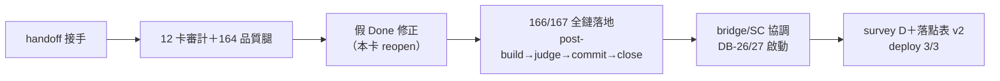

## Description

<!-- SECTION:DESCRIPTION:BEGIN -->
上一個 marshal session context 84% 滿退役。本卡是 marshal v2 的 write-access vehicle：接手在飛 worker 收線、scbus 協調、AIR-163 survey 收斂、AIR-164 後續。handoff packet：/Users/ctai/Github/ai-guide/.agent-tmp/handoff-packet-20260922.md
<!-- SECTION:DESCRIPTION:END -->

## Implementation Notes

<!-- SECTION:NOTES:BEGIN -->
2026-09-22 審計改正（lite-verify agent_01cd2439）：本卡原為 bridge --wt --card 的 write-access vehicle，建卡同分鐘標 Done＝假 Done——派工 glm 三發全敗（job-mucos9r5 provision 缺失；job-mucoudxf-yffhw2／job-mucp333f-88xfei carrier 回 "Unknown command: <WT path>"，exit 0 假完成，WT 零產物）。新 marshal session 接手執行本卡實義（收線＋協調）：worker 審計雙腿完成（12 卡審計＋AIR-164 品質腿）、AIR-163 survey 保全＋落點表固化、scbus bridge 線信送達（dcf7a3e1）。剩：metadata 修正、WT 清線、SC-201 排期。

2026-09-22 深夜結算（marshal session 交棒前）：metadata 修正已落地（3fad7160）；三 WT 收線完成（air-163/164/165 全滅，main 3fad7160）；bridge 線協調完成（DB-26 鏈啟動、回執待收）；scbus 機制實測生效。剩餘移交新 session（handoff：.agent-tmp/handoff-packet-v2-20260922.md）：①收 AIR-166 實作工＋survey D（在飛）②A-bar 第二封信待 user「送」（真 HOME 要求）③工單信三封（mosaic 主權 session 位址待 user 指認）④AIR-135 amendment 另卡⑤AIR-155 dogfood 最後跑。
<!-- SECTION:NOTES:END -->

## Final Summary

<!-- SECTION:FINAL_SUMMARY:BEGIN -->
marshal continuation 實義完成：12 卡完成度審計→假 Done 修正（本卡 reopen）→164 品質腿→166/167 全鏈落地→三 WT 收線→bridge 線協調→survey D→落點表 v2→deploy 3/3。剩 dogfood 與 mosaic/code-reality 位址見 handoff packet v2。

<!-- SECTION:FINAL_SUMMARY:END -->
