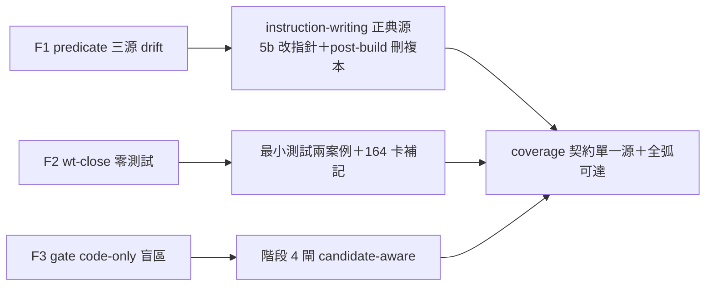

## Description

<!-- SECTION:DESCRIPTION:BEGIN -->
**這卡解什麼**：AIR-164 品質審查腿三條 🟡 findings 修復（報告：.agent-tmp/audit/air164-quality-review.md）。
(F1) coverage predicate 三源 drift：implement 5b（skills/implement/SKILL.md:332）自稱單一源、instruction-writing A5（skills/instruction-writing/SKILL.md:49-55，commit 771df0fe）另立判準且語義分歧（跨 session 消費者限定詞／MUST NOT 範圍／root-owner 免建 local 張力）、post-build:130 括號複本自相矛盾。修法：instruction-writing 為規範源；implement 5b 改指針＋留機械觸發面；post-build 刪複本；root-owner 案（root 明示擁有即免建 local）在 5b 處置明文。
(F2) wt-close.sh TRUNK_ADVANCED 條件分支（:213-214, :254-259）零測試；AIR-164 卡 Scope 承諾 tests/ 未動——本卡補最小測試，並在 AIR-164 卡 notes 補記 plan-vs-delta。
(F3) post-build coverage gate code-only 弧盲區：階段 4 標題閘（skills/post-build/SKILL.md:100）使「新可執行入口＋零 .md 變更」的弧跳過偵測——閘條件改「僅 .md 變更或 coverage candidate 非空」或偵測上移階段 0 triage（擇一，取改動最小者）。

**不做什麼**：AIR-164 八條已 pass AC 不重做；CR dirty-WT source identity（AIR-163 P0 殘留，歸 AIR-135 線另卡）；F7 bundle redeploy（例行）；F4/F5 卡面勘誤僅記 AIR-164 notes 不另開工。

<!-- SECTION:DESCRIPTION:END -->

## Acceptance Criteria
<!-- AC:BEGIN -->
- [ ] #1 predicate 單一源：rg 全 repo 完整判準僅 instruction-writing 一處；implement 5b 為指針＋機械觸發面；post-build 無複本；root-owner 處置明文（single-source drift 規則義務同步所有引用面）
- [ ] #2 wt-close 最小測試：trunk 前進→receipt 含 graph-stale-reminded；零 commit close→純 pass；uv run pytest 綠
- [ ] #3 code-only 弧可達：新可執行入口＋零 .md 變更情境會觸發 coverage 偵測（流程實跑或文字推演擇一，記錄 notes）
<!-- AC:END -->
