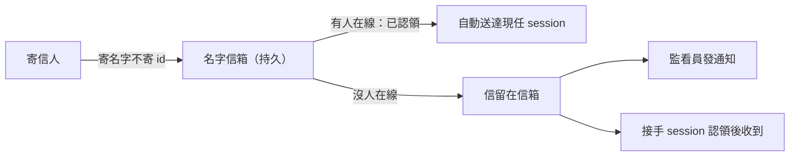

## Description

<!-- SECTION:DESCRIPTION:BEGIN -->
**問題**：現在 session 之間寄信，地址是一長串 session id。這種 id 識別的是「哪個視窗開著」，不是「誰負責這條工作線」。所以：換了 session 地址就失效（信寄進已關閉視窗的信箱）、地址太長複製會截斷出錯（已出事兩次）、你要一直提醒 AI 去收信。實測（0923 盤點）：98 封信 23 封沒人讀、13 封寄進死信箱、marshal 的名字甚至掛在一個早就結束的 session 上。

**這張卡要做**：
1. 地址改成「有意義的名字」（例如 ai-guide-marshal）。信寄到名字、不寄到視窗；誰在線上就把名字認領過去，session 關了信不丟，下一個接手的認領後收得到。（今天已手動試辦：名字重綁後信自動出現在現任 session，驗證通。）
2. 寄信可標急緩：急件（打斷在跑的）／普通（下次開口時給）／只是通知——現在只有一種模式。
3. 背景監看員：沒人認領的信箱有信就通知（借用現成 bridge_waiter 形態，不是常駐程式）。
4. 記錄「信什麼時候被讀掉」——現在完全不可考。
5. 順帶修：registry 一千多筆假活註冊資料；codex/claude 端只能報到不能自動收信（只有 zcode 能）——列入規格。

**分工**：本卡只寫規格＋驗收；實作歸 sc-router repo，規格用工單信送過去（寄出前問你）。

**不動**：對外發送同意規則；不做常駐 daemon。

證據與完整設計：.agent-tmp/air-135-disc/marshal-rethink-convergence-proposal.md（D4 節）＋flash-scbus-usage-result.md。
<!-- SECTION:DESCRIPTION:END -->

## Acceptance Criteria
<!-- AC:BEGIN -->
- [x] #1 契約文件落地：位址語義＋binding 生命週期（claim/transfer/tombstone/lease）＋三態語義＋consumed_at stage＋registry 分離——單一源落點（skills 或 governance docs），含 zcode/codex/claude/muse 四面 drain 能力矩陣
- [x] #2 sc-router 工單信草稿完成（含 flash B 實證數據＋D4 契約全文＋drain adapter 缺口清單）——送出前 user 授權＋主權 session 位址
- [x] #3 journal 在飛總表機械生成 helper 落地（查 bridge show/scbus list/git status 現值輸出）＋弧結算流程接線（狀態欄位禁手抄）
- [x] #4 handoff packet 模板增『收取法形』欄位正典化（flash A 結構發現：收取法形全活、狀態快照形寫下即爛）
<!-- AC:END -->

## Implementation Notes

<!-- SECTION:NOTES:BEGIN -->
【0923 交付段收線】AC2 工單信已送 sc-router 主權 sess_536d749c（5e42fba6，user 授權＋位址）；AC3 helper 落地（inflight_snapshot.py：三路查現值、單路容錯、11 tests＋真資料 565 jobs/776 live rows 實跑；實跑暴露 331 筆 unknown 舊 envelope——job 生命週期終態定義＝bridge/sc-router 裁決素材）；AC4 handoff 收取法形正典化（+4 行，狀態快照禁入）。AC1 契約單一源落點保留——契約 v2 暫住 .agent-tmp，待 sc-router 接受後落 governance 單一源。卡留 In Progress（AC1＋外部實作）。殘留三項記 worker-report（bridge 在飛語義含 unknown/model 欄/scbus 假活列如實輸出）。

【0924 驗收＋AC1 落地】sc-router S1-S6 交付（main a8a5e0b）驗收通過：部署升級 install.sh（uv tool install --force；registry 無損遷移——1268 sessions/14 claims/my session 健在）；§8 五項機驗 PASS——①transfer gen1→2 後寄 address 新 holder 收到（schema v2 envelope）②steer/notify 無 holder fail-loud exit 1＋可操作提示、queue 可達、fallback queue 顯式降級 fallback_used:true ③address ls --pending 信封面＋ack acked:true generation 帶回 ④observe 後 lease_expires_at_us 不變（假新鮮消失）⑤muse steer fail-loud exit 1；對抗案例 double-claim name_conflict、stale holder renew/ack fencing exit 1（generation 指控）。AC1：契約 v2 落 governance/scbus-address-contract.md。備考：headless queue 不偽報 consumed 有部分旁證（queue-mode ack consumed:false），resume binding 語義未獨立複驗（歸 SCR e2e 覆蓋）。
<!-- SECTION:NOTES:END -->
