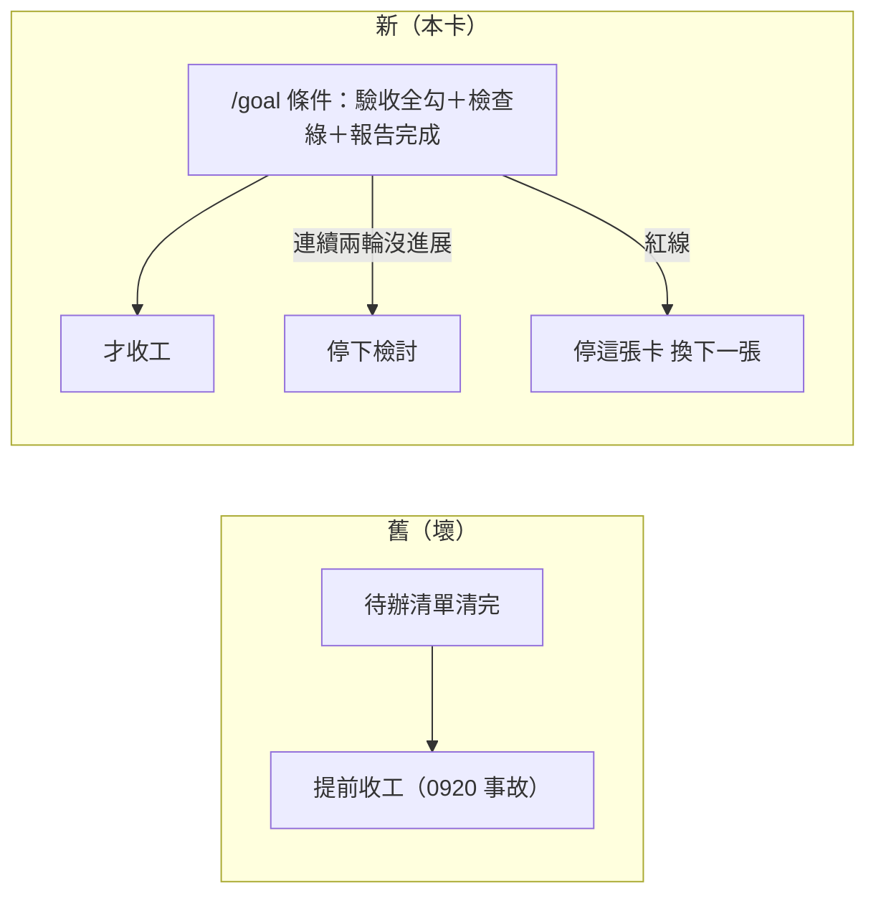
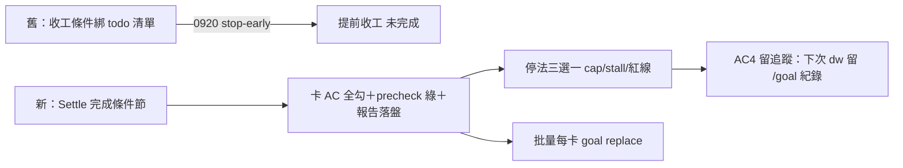

## Description

<!-- SECTION:DESCRIPTION:BEGIN -->
**問題**：deep-work（你下「自動做完」指令後 AI 自己跑的模式）收工條件寫錯了——它把「session 裡的待辦清單清完」當成做完，而不是「卡上的驗收條件全部通過」。所以 0920 那次很快掃完待辦就停了，實際工作沒做完（你的原話「deepwork 還是很快就停了」）。查歷史還發現：說好的「進場時手動編譯 /goal 完成條件」從來沒被實作過一次——操作說明散在別張卡的筆記裡，skill 裡沒有可以照做的地方。

**這張卡要做**（改 deep-work skill 的說明書）：
1. 收工條件改成：卡的驗收條件全勾＋檢查全綠＋完成報告寫完。禁止綁待辦清單。
2. 在 skill 裡寫下「進場時怎麼編譯 /goal」的操作說明（先放三行過渡版），下一個 session 有明確步驟可照做。
3. 停下規則寫清楚：連續兩輪沒實質進展就停（不是傻跑）；遇到紅線（對外發送、破壞性動作）立刻停這張卡、換下一張。
4. 一次做多張卡：每張卡換一次目標，最後交一張總報告（不是每張都來問你）。
5. 減少不必要的請示：卡片順序、做法方向這種已經有依據可判斷的事自己決定（0922 你罵過「全是過度上拋」那次的判準：已經有卡、已經有定案的事自己判斷；新承諾、跨 repo 寫入才問你）。

**不動**：skill 裡旗艦裁決段（逐字不碰）、安全紅線、commit 授權規則。

**驗收**：條文跟 135.7 卡零矛盾；下次 deep-work 真的照新說明用 /goal 並留紀錄（歷史上零紀錄，這是第一次）——也是夜間批量演練的前置。

歷史證據：.agent-tmp/air-135-disc/flash-dw-history-result.md。
<!-- SECTION:DESCRIPTION:END -->

## Acceptance Criteria
<!-- AC:BEGIN -->
- [x] #1 L240 裸 /goal 範例置換＋其下 3 行過渡注記落位（條件＝卡 AC＋precheck＋report、禁綁 todo、stall N=2、批量 replace）——0923 雙腿審查要求①；驗證＝條文 diff＋rg 術語掃描
- [x] #2 完成謂詞＋停法三選一＋批量輪換＋dw 承諾制＋lane 可決判準（含協調 vs 新承諾分界）入 skill 條文；驗證＝與 135.7 卡零矛盾對錶＋harness 中立表述（無單家寫死）
- [x] #3 fence 驗證：skill L171-213 旗艦裁決段逐字零變更（diff）；autonomous-execution 與 outward rule 未動
- [ ] #4 dogfood 前置成立：下一次 dw 進場照新條文編譯 /goal 並留調用紀錄（史證缺口——歷史上零 /goal 調用紀錄，第一次留證）；本 AC 為 135.7 AC#7 批量夜間 dogfood 的前置
<!-- AC:END -->

## Implementation Notes

<!-- SECTION:NOTES:BEGIN -->
【0923 實作收斂】worker（5.3）落地兩 hunk（Settle 節＋L254 置換+過渡注記）；fresh-eyes 審查（5.3）verdict＝approve-with-findings。Judge（marshal 5.3）裁決：F1 採納修復——worker 編輯因 wt-open(170) 把 primary 歸位 main 而晾在 canonical，被 admission guard 攔下（防線實證）→走卡 WT（patch 搬運＋branch -f 重置，d9b25c02 與 main 3b3448aa patch 等同零損失）；F2-F8 全採納（merge 入 ask-list／fail-closed judgment-required／evidence delta 三元定義／pending safe-default／precheck 措辭／概括語禁令／C5b 錨點）；F9 記 drift-watch（check_single_source REGISTRY 候選，未登記）。fence L171-213 三次複驗逐字零差。commit 7bbbe6bd（main，wt-close full：rebase→merge→WT+branch 清除零殘留）。AC#4 開放——下次 dw 進場照新條文編譯 /goal 留紀錄後結案。
<!-- SECTION:NOTES:END -->

## Final Summary

<!-- SECTION:FINAL_SUMMARY:BEGIN -->
**dogfood AC#4 追蹤（2026-09-23 收案留追蹤）**：本卡條文面全數落地（AC1-3 勾）；AC#4＝下次 deep-work 自然進場照新條文編譯 /goal 並留調用紀錄（歷史零紀錄的第一次）——不為結案造弧，留自然 dogfood 追蹤。條文 commit 7bbbe6bd。

<!-- SECTION:FINAL_SUMMARY:END -->
