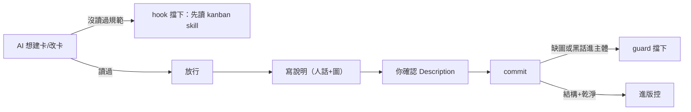

## Description

<!-- SECTION:DESCRIPTION:BEGIN -->
**問題**：卡的說明（Description）是給你看的——你確認了才 commit。但 AI 建卡時常常沒先讀寫卡規範就動手，寫出一堆內部代號黑話（例如 D4、C5a、flash B 這種只有 AI 自己懂的詞），要你來抓——今天 AIR-168/169 就發生了一次。結構性的部分（沒畫圖）commit 閘本來就會擋，但「沒讀規範就動卡」和「黑話混進說明」目前沒有機械防線，全靠 AI 自律＋你的眼睛。

**這張卡要做**（兩個閘）：
1. **動卡前閘**：裝一個 hook——這個 session 還沒讀過寫卡規範（kanban skill）就想跑建卡/改卡指令時，直接擋下執行，訊息指引先讀規範。讀過就放行。（ZCode 實測支援這種「工具執行前可拒絕」的 hook；用讀檔標記判斷，不做複雜查詢。）
2. **黑話掃描**：現有的 commit 閘（card-diagram-guard）加一條 regex 掃描——內部代號進了說明主體就擋 commit。代號有明確 pattern（D4、C5a、flash B、job 編號），機械抓得到；結尾的證據路徑行不算（那是指針不是黑話）。

**不動**：「說明是不是真的看得懂」這種語義判斷，維持由你確認 Description 把關——機械管結構、人管語義，這是設計。

歸屬：AIR-135.5 開卡協議的延伸（現有 commit 閘當年就是從那張卡的協議①做出來的），以 amendment 註記回 135.5 卡。

<!-- SECTION:DESCRIPTION:END -->

## Acceptance Criteria
<!-- AC:BEGIN -->
- [ ] #1 動卡前閘落地：PreToolUse hook（zcode＋CC 註冊）——session 未載入 kanban skill 而執行 backlog task create/edit → deny＋指引訊息；已載入（session 標記）→ 放行；附 unit tests（擋/放行兩案）
- [ ] #2 黑話掃描落地：card-diagram-guard 擴充——Description 主體內部代號 regex 掃描（D\d、C\d[ab]、flash [ABC]、job- 编號等 pattern）→ deny＋訊息；結尾證據指針行豁免；附 tests
- [ ] #3 AIR-135.5 卡 amendment 註記（協議①延伸登記：兩閘出處與判準）
- [ ] #4 dogfood：本 repo 下次建卡實測兩閘各一次（擋一次＋放行一次，留紀錄）
<!-- AC:END -->
