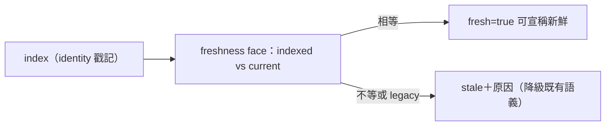

## Description

<!-- SECTION:DESCRIPTION:BEGIN -->
**問題**：code-reality v0.9.3 已落地 source identity freshness face（content-addressed sha256-v1），ai-guide 兩處 instruction face 還寫著「缺口未關前只能證偽 stale、不能宣稱 fresh」的誠實降級條款——缺口已關，條文該升級引用新機制。

**這張卡要做**：更新兩個檔的 freshness 段落——①skills/cr-query/SKILL.md「Stale graph check」②skills/review-engine/SKILL.md「CR freshness preflight」——從「HEAD 對照＋誠實降級」升級為引用 freshness face 消費命令（機器可讀欄位：fresh 布林、stale_reasons、indexed/current identity pair、serves）；保留降級語義給 legacy index（無 identity 戳記時 face 自己會回報 legacy-signals——降級語義不廢，只是換機制面承載）。

**不做**：不改 AIR-135 invariant 條文（判準式 fresh ⇔ indexed == current 不變，機制面已補）；不動 graph 重建慣例；不動 admission guard。

**驗收**：ai-guide index 已 rebuild 激活 identity pair（fresh=true 實證完成）；兩 face 條文更新後 rg 一致性檢查＋與 AIR-135 判準式零矛盾。
<!-- SECTION:DESCRIPTION:END -->

## Acceptance Criteria
<!-- AC:BEGIN -->
- [ ] #1 skills/cr-query/SKILL.md「Stale graph check」升級：引用 freshness face 消費命令與欄位；誠實降級語義保留給 legacy-signals 態
- [ ] #2 skills/review-engine/SKILL.md「CR freshness preflight」升級：L2 preflight 消費 freshness face（機械判準取代 HEAD 對照宣稱）；降級路徑保留
- [ ] #3 驗收：ai-guide freshness --json fresh=true 實證（已完成）＋兩 face 條文 rg 一致性＋與 AIR-135 invariant 判準式零矛盾
<!-- AC:END -->
