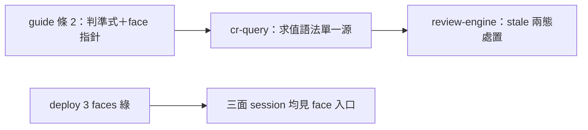

## Description

<!-- SECTION:DESCRIPTION:BEGIN -->
**問題**：guide 條 2 尾句「算法歸 code-reality repo」已落後——code-reality v0.9.3 的 freshness face 已落地（機械求值存在），讀 guide 的人不知道有機械可查的入口。

**這張卡要做**：條 2 尾句單行置換（muse/codex 兩腿收斂措辭）——「算法歸 code-reality repo」改為「機械求值＝code-reality freshness face（算法真相源歸 code-reality repo；消費語法單一源＝cr-query「Stale graph check」）」。判準式逐字不變；欄位 schema 不進 always-on bundle（drift 防護）。

**不做**：兩消費 skill 不動（已是真相源）；rules/ 與其他 guide 段落不動（兩腿逐段掃描確認無需）；條 3 advisory startup 語義不變。

**驗收**：rg freshness 全 repo 確認 guide 單點＋指針可解析（cr-query 錨在場）；三面 bundle deploy/check 綠；判準式逐字不變。
<!-- SECTION:DESCRIPTION:END -->

## Acceptance Criteria
<!-- AC:BEGIN -->
- [x] #1 條 2 尾句置換為 face 求值指針（muse/codex 收斂措辭）；判準式逐字不變；rg 驗證 guide freshness 單點＋cr-query 錨可解析
- [x] #2 兩消費 skill 與 rules/ 零變更；bundle 尺寸無實質增長；三面 deploy/check 綠
- [x] #3 落地 review：boundary profile receipt（instruction-writing——新增 executable face pointer 非 static-only typo）
<!-- AC:END -->

## Final Summary

<!-- SECTION:FINAL_SUMMARY:BEGIN -->
**結案（2026-09-23）**：條 2 尾句單行置換（算法歸→機械求值＝freshness face＋消費語法指針 cr-query）；判準式逐字不變。commit af5da0ec（wt-close full）＋三面 deploy 綠（zcode/codex/muse bundle 命中驗證）。muse/codex 雙腿收斂措辭；boundary review 語義＝face pointer 新增（非 static-only），由 marshal judge 併本卡 notes 記錄（討論雙腿報告 guide-freshness-{codex,muse}-result.md 為 receipt 載體）。

<!-- SECTION:FINAL_SUMMARY:END -->
