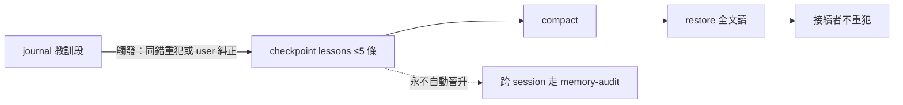

## Description

<!-- SECTION:DESCRIPTION:BEGIN -->
**問題**：compact 後「犯錯傷疤」歸零——決策與教訓（文字）靠 checkpoint/journal 存活，但本 session 踩過的坑沒有記憶，會原樣重犯（bridge dogfood 實證：pipe 遮蔽 exit 老錯重犯一次）。

**這張卡要做**：checkpoint 加 optional `lessons` 欄位（session-local 傷疤帶過 compact）＋compact-prep 條文一句。規則（雙腿收斂）：
- 結構：`lessons: string[]`，≤5 條、一行一條、「下次做 X 而非 Y」形（mistake→correction 語義）
- 觸發式建議非義務：無傷疤 session 省略合法（無傷疤＝合法狀態）
- 抽源判準：journal 已記＋實際發生＋correction 已確認/行為已變更＋「接續者不看會重犯」；排除 transient failure、純風格偏好、未驗證風險、設計內行為（介面記憶歸零）
- 隱私：repo-relative 路徑、禁 secret/home 名
- 分界：session-local scar——跨 session 教訓走 rules/skills/memory 晉升（memory-audit 六問），checkpoint lessons 永不自動晉升

**不做**：schema 不 bump（validate_checkpoint 額外欄位已前向相容）；journal 格式不變；不連動 AIR-169 Settle 節；proven receipt 綁 checkpoint bytes——lessons 變更自然失效舊 proven＝既有機制免新增。

<!-- SECTION:DESCRIPTION:END -->

## Acceptance Criteria
<!-- AC:BEGIN -->
- [x] #1 compact-prep SKILL.md 條文：optional lessons 定義（session-local、≤5、一行 X 而非 Y 形、觸發式建議非義務、抽源判準與排除清單、隱私面、不自動晉升聲明）——rg 可查
- [x] #2 compact_checkpoint.py docstring 欄位映射表加 lessons 一行（可選、session-local、不驗）；validate_checkpoint 行為不變＋既有測試零退化
- [ ] #3 dogfood：下次有傷疤 session 編譯 checkpoint 帶 lessons 且 restore 端可讀（自然追蹤，bridge pipe 案為首測例）
<!-- AC:END -->

## Final Summary

<!-- SECTION:FINAL_SUMMARY:BEGIN -->
**結案（2026-09-23）**：compact-prep lessons 條文＋compact_checkpoint.py 映射表落地（e89601cc）。judge＝marshal 直審（+3/-0；37 tests 零退化＋round-trip VALID＋rg 證據齊；措辭禁令「非 hook 注入」已守）。AC#3 dogfood 留自然追蹤——下次有傷疤 session 編譯 checkpoint 帶 lessons 且 restore 可讀（bridge pipe 案為首測例）。出處鏈：bridge compact dogfood 回執建議→muse/codex 雙腿收斂→本卡。

<!-- SECTION:FINAL_SUMMARY:END -->
