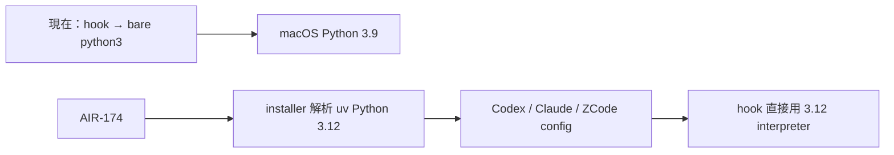

## Description

<!-- SECTION:DESCRIPTION:BEGIN -->
目前 Codex／Claude／ZCode 的治理 hooks 多數直接叫 `python3`，在這台機器會落到 macOS 內建 Python 3.9.6；但 ai-guide 本身已要求 Python 3.12 以上。這張卡把治理 hook runtime 統一到 uv 管理的 Python 3.12，並由 installer 在安裝時解析實際 interpreter 路徑，再投影到各 harness config。

不改 macOS 的 `/usr/bin/python3`，不靠 shell PATH，也不讓每次 hook 都經過 `uv run`。既有 hook 行為、stdin/stdout/exit contract 必須維持；部署前後要驗證 deny gate、sensor 與 compact restore 都沒有退化。

<!-- SECTION:DESCRIPTION:END -->
