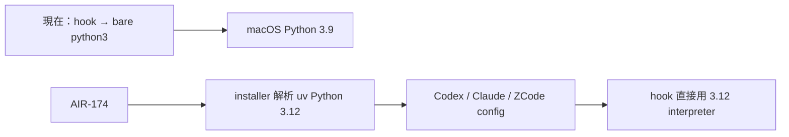
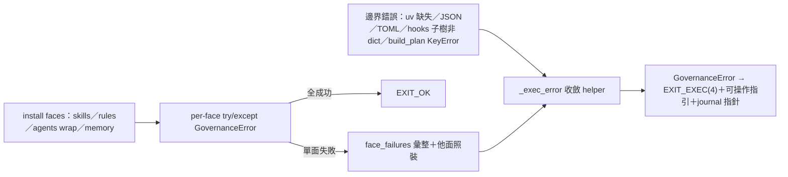

## Description

<!-- SECTION:DESCRIPTION:BEGIN -->
目前 Codex／Claude／ZCode 的治理 hooks 多數直接叫 `python3`，在這台機器會落到 macOS 內建 Python 3.9.6；但 ai-guide 本身已要求 Python 3.12 以上。這張卡把治理 hook runtime 統一到 uv 管理的 Python 3.12，並由 installer 在安裝時解析實際 interpreter 路徑，再投影到各 harness config。

不改 macOS 的 `/usr/bin/python3`，不靠 shell PATH，也不讓每次 hook 都經過 `uv run`。既有 hook 行為、stdin/stdout/exit contract 必須維持；部署前後要驗證 deny gate、sensor 與 compact restore 都沒有退化。

<!-- SECTION:DESCRIPTION:END -->

## Acceptance Criteria
<!-- AC:BEGIN -->
- [x] #1 installer render 將 {{HOOK_PYTHON}} 解析為已安裝的 uv-managed CPython 3.12 絕對路徑；缺 uv／缺 3.12 時 fail-loud 並給可操作修復指引
- [x] #2 CC／ZCode／Codex canonical registrations（含 compact restore）全部使用同一 interpreter token；governance templates 不再殘留 bare python3
- [x] #3 governance focused tests＋受影響 hook tests 綠；mixed-session／rollback 所需 Python 3.9 compatibility gate 保留且綠
- [x] #4 authoring WT 的 hooks dry-run／check／verify 如實反映 derived live config 尚未投影；live install 僅於收線後從 canonical 執行
- [x] #5 Muse＋Codex post-build reviews 與 Muse judge 收斂；control-plane 四欄 receipt 齊全後才具 landing eligibility
<!-- AC:END -->

## Implementation Notes

<!-- SECTION:NOTES:BEGIN -->
## 639a479b 三方審查收斂——修復工單回貼（2026-09-23 marshal 線）

審查方＝codex fresh-eyes（request-changes，F1-F4）＋muse fresh-eyes（approve-with-findings，R1-R7）＋5.3 marshal seat（hook 面直審＋機械抽驗）；對象 main 639a479b（27 檔 +1381/-145）。全文報告＝`.agent-tmp/air-174-review-639a479b.md`（F1-F4／R1-R7 全列）。**三項必修，修完前 hooks 不應視為可信**：

1. **memory gate 繞過口**（codex F2，marshal 抽驗證實）：`hooks/block-memory-index-write.py:130` 用 `line.startswith("description:")` 判 frontmatter key——寫 `description : <value>`（冒號前加空格）不匹配，繞過全部 description deny 規則（>100 chars／hash／日期／session-id），之後仍被 index generator 正常投影。根因＝hook parser 與 consumer（`.agents/memory/_generate_index.py:102-120`，`partition(":")` 後 strip）不等價（writer/consumer contract mismatch）。修法：parsing 與 generator 收斂同一 helper／同一 normalization；至少補 `description :` deny 測試＋canonical allow 對照組。
2. **compact 遞迴濾網誤殺**（codex F3，marshal 抽驗證實）：`hooks/compact-tail-inject.py:81` 用 `INJECT_MARKER in text` 子串匹配判「上代注入」——任何提到 `<compact-tail-inject>` tag 的正常訊息（含最新指示那輪）整則被刪；既有測試把過寬行為固化成 oracle。修法：改辨識實際 injection envelope／完整 framing（如 trimmed text 以 marker 開頭）；補正向測試「一般句子內提到 marker 仍保留」。
3. **Python 命令規範單一源衝突**（codex F4＋muse R1 同族）：三份文本互相矛盾——`rules-reminder` 仍絕對宣稱「所有 Python 命令必須 uv run」；`tool-discipline` 已有 hook owner-runtime 例外；`python-standards`（3.12+、`X | None`、scope 無 hooks 豁免）——照它改 hook 成 `X | Y` 即部署 break（ZCode hook 執行面 `/usr/bin/python3`＝3.9）。修法：rules-reminder 改引用 tool-discipline 單一源（刪第二份絕對規則）；python-standards 補 hooks 豁免指針一句（同 tool-discipline 形態）。

**卡面事實修正**：639a479b 實際落地＝**分割 runtime**（hooks 維持 3.9 相容執行模型，雙 runtime 3.9.6＋3.14.4 probe 已過；repo tests 走 ≥3.12）；標題所述 3.12 deployment migration（installer 解析 uv Python 3.12＋投影三家 registration＋live firing）**尚未實作**——故本卡留 To Do 正確、639a479b 不算本卡完成、雙 runtime regression tests 不應當作 3.12 migration 的 acceptance。

**修復 commit 驗收建議**：① `description :` bypass 案 deny 測試＋canonical allow 對照 ② 提及 marker 的正常訊息保留正向測試 ③ `rg "所有 Python 命令必須|uv run" rules-reminder` 與 tool-discipline 一致＋python-standards 含 hooks 豁免句 ④ 卡面敘述改「分割 runtime」（標題所述 3.12 migration 另行） ⑤ 全套件綠＋雙 runtime probe 複跑。建議項（可不修，記錄在案）：GIT_CEILING_DIRECTORIES＋--basetemp 測試隔離前提寫進測試文檔；`compact-tail-inject.py:121` STATE 取前 4KB（保最舊）與 tail 保最新不對稱；已知 heuristic 漏抓（YAML folded、CJK 緊貼、全形連字號）確認 rules 端未宣稱「完整攔截」。

接續結算：原 rules/hooks hardening 已在 main 639a479b；三項審查必修已完成，AIR-174 runtime migration 與 CC exec-form parity 修復正進行最後整合審查。下方最終回執將取代上方歷史 To Do 觀察；保留原始審查全文供追溯。

最終收斂：原 hardening 與三項必修完整保留；IR1/IR2 獨立反例修復並複審通過。最終完整測試 2083 passed／2 intentional skips。Receipt: classification=boundary / review=native fresh+intent, Muse external+Arbiter, fresh Muse IR2 final APPROVE (job-mudzulxa-e1dpd1); main judge adopts closure / session-freshness=fresh (source hashes verified) / deployment-surfaces=pending (live configs and bundles not deployed).

【0923 卡面更正】原標題「統一到 Python 3.12 runtime」為貼錯（user 確認）——實際落地＝分割 runtime（hooks 3.9 相容＋installer 解析 managed 3.12）；3.12 deployment migration 未含。receipts 目錄指針：ai-analysis/_tasks/09-23-hook-python312-runtime/。跟進批＝AIR-176；deployment 繼任待開。

【0923 批次二】AIR-178 深審（82/100）F1/F2 轉入本卡修復：F1＝面獨立語義二選一＋實作對齊（install.py:1060 注釋 vs 849-857/1065-1117/1121 raise-abort）；F2＝traceback 收斂 GovernanceError EXIT_EXEC(4)＋每實例回歸案例（run_wrap 734、871-873、442-492、281-283、750、main 2015-2017）。F3-F7＋Q1 小修另批不隨本批。

【0923 批次二 judge 收斂】approve-with-findings 88/100，F-A~F-D 修正落地（33 passed／ruff 綠／L4 行為零變更）：F-A 注釋限定範圍（本批收斂 registrations/TOML/uv/json/hooks 子樹面→EXIT_EXEC(4)；殘留待收斂＝manifest 檔缺席 FileNotFoundError、surfaces/registrations 其餘 KeyError 家族、模板檔缺席——待小修批）；F-B 注釋更正（apply 層不消費 registrations）；F-C/F-D 型別＋kw-only。六項偏差全 ACCEPT。待清記錄（只標不刪）：F-E dead assignment exit_code=EXIT_EXEC（apply_plan 約 L936）＋兩處不可達 if rc!=EXIT_OK（約 1161-1162/1227-1228）；F-F build_plan 階段失敗 journal 指針指向舊 run。行為變更備忘：uninstall 面 hooks:false 舊碼靜默刪鍵／install 形靜默覆寫→新碼拒碰 raise（fail-loud 方向正確）。
<!-- SECTION:NOTES:END -->

## Final Summary

<!-- SECTION:FINAL_SUMMARY:BEGIN -->
批次二 F1/F2 收斂：install.py per-face 面獨立（單面失敗他面照裝）＋fail-loud GovernanceError 契約（EXIT_EXEC(4)＋journal 指針），13 回歸案例 RED→GREEN、全量 2096 passed、judge approve-with-findings 88/100 修正收斂。殘留待收斂面與 dead code 記卡 notes 待小修批。

<!-- SECTION:FINAL_SUMMARY:END -->
