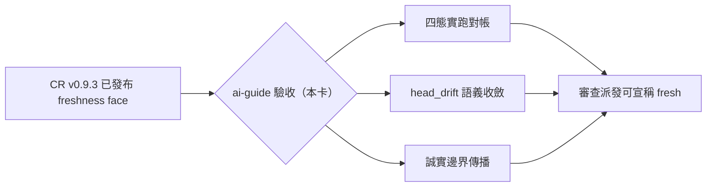

## Description

<!-- SECTION:DESCRIPTION:BEGIN -->
code-reality 的 P0「source identity」已落地發布 v0.9.3：新命令 `code-reality freshness --repo` 改用「內容身分」判斷索引圖新鮮與否（連未提交的編輯內容都算進身分），取代以往只看 mtime／HEAD 的舊判準。ai-guide 是消費端——review 派發前靠這個檢查決定 graph 證據能不能宣稱新鮮。跨 repo 主權下驗收歸消費端：這張卡＝拿實物驗收這項能力，並把 ai-guide 側條文與實物對齊。

**做什麼**

- 機械驗收：實跑 freshness face 的 fresh／stale／legacy index／無 slot 四態（exit code 0/1/2＋JSON 欄位），對照 AIR-171 已接線條文（cr-query「Stale graph check」、review-engine「CR freshness preflight」）宣稱的行為是否一致
- 語義收斂：CR 新定義「HEAD 前進不算過期——identity 相同就 fresh」（head_drift 走獨立欄位、不進 stale_reasons）；cr-query 條文仍殘留「HEAD 不一致→重建」舊句。擇一收斂：按 AIR-135 條 2，identity 是唯一判準，HEAD-only 判準依規則禁用——舊句改寫對齊
- 誠實邊界傳播：CR 披露兩項殘餘風險——同尺寸＋同 mtime 的內容替換可逃過 cache gate（stamp 端全量重 hash 兜底，最壞 false-stale 安全方向）、冷啟首跑全量 hash 可破 1s——review-engine preflight 的「<1s cheap check」宣稱補上前提

**不做什麼**

- 不改 code-reality 源碼（mutation 歸 CR 線主權；驗收發現缺陷回執其主權 session sess_0d699835）
- 不動 rules bundle（本卡只碰 skills 面——symlink 即時生效，無部署步）

<!-- SECTION:DESCRIPTION:END -->
