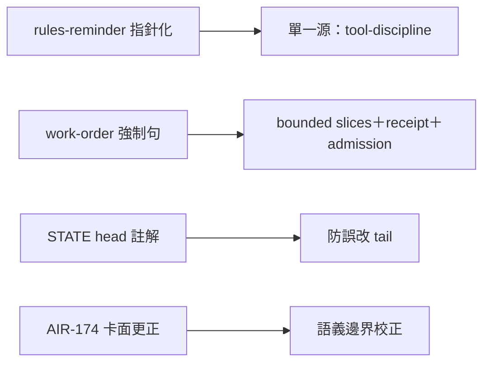
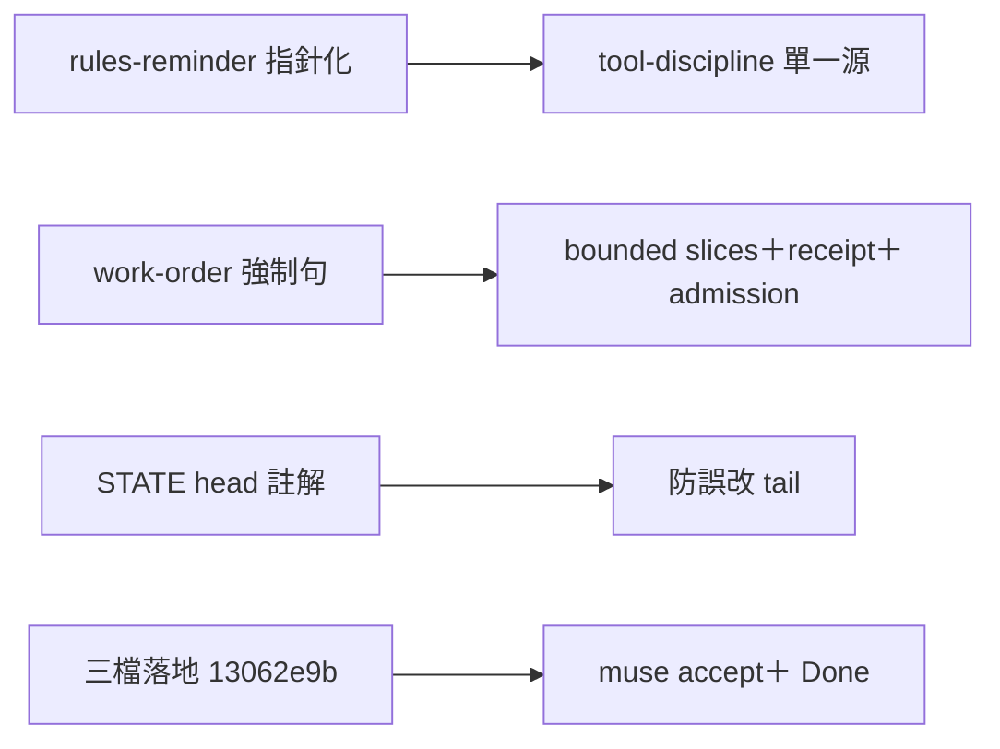

## Description

<!-- SECTION:DESCRIPTION:BEGIN -->
**問題**：air-174 修復三方審查（約 8.5 分通過）留下四個跟進項＋bridge 優化提案①（工單範本強制句）——都是 instruction/小碼層收尾。

**這張卡要做**：
1. rules-reminder 雙殘留修正：description 的「uv run for Python」改中性指針（owner=tool-discipline）；L138 口訣「uv run 是王道」改「uv run 問 tool-discipline」或刪——reminder 載體只准「觸發＋指針」，不准第二定義。
2. work-order 範本（skills/_common/work-order.md）加派工端強制句：writer 工單必含 bounded slices＋checkpoint receipt 落盤條款（AIR-135.7 契約原文）＋派工前 admission 步驟註記（usage probe＋family identity 驗證）——bridge 優化提案①。
3. compact-tail-inject.py read_state 加一行註解：STATE 覆寫非累積（state-md-write.md），head＝最新，防後人誤改 tail。
4. AIR-174 卡 metadata：標題更正（貼錯）＋notes 補 receipts 目錄指針（ai-analysis/_tasks/09-23-hook-python312-runtime/）。

**不做**：install.py 全量審查（另卡）；deployment 繼任（另卡）；journal 格式；AIR-169 Settle 節。

**驗收**：rg「所有 Python 命令必須|uv run 是王道|uv run for Python」rules-reminder 零命中；work-order.md 含三要素；STATE 註解在場；AIR-174 卡面更正。
<!-- SECTION:DESCRIPTION:END -->

## Acceptance Criteria
<!-- AC:BEGIN -->
- [x] #1 rules-reminder 雙殘留清零：rg「所有 Python 命令必須|uv run 是王道|uv run for Python」零命中；規範指針指 tool-discipline
- [x] #2 work-order.md 含 bounded slices＋checkpoint receipt 強制句＋admission 步驟註記——rg 可查；bridge 首批 dogfood 配合（回執他線）
- [x] #3 read_state STATE 註解一行＋AIR-174 卡標題/notes 更正（receipts 指針）
<!-- AC:END -->

## Final Summary

<!-- SECTION:FINAL_SUMMARY:BEGIN -->
**結案（2026-09-23）**：三檔 +6/−2 落地（rules-reminder 雙殘留清零／work-order 派工端強制句＋admission 步驟／STATE 註解一行）。muse 驗收腿 verdict=accept（AC1-3 自跑 rg 全過；diff 數字由 marshal 補驗 git diff --stat 一致）。commit 13062e9b（wt-close full 零殘留）。bridge 首批 dogfood 配合：work-order 強制句即 DB 優化提案①（立即生效項）。

<!-- SECTION:FINAL_SUMMARY:END -->
