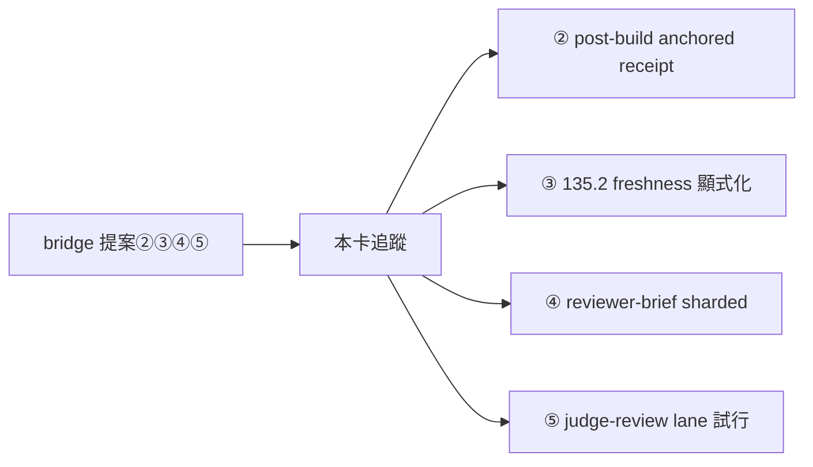

## Description

<!-- SECTION:DESCRIPTION:BEGIN -->
**問題**：bridge 線優化提案（七弧 2.0.28 出貨後的三家族討論合成）五案中，①已由 AIR-176 落地；②③④⑤ 為下一批 instruction 修正——開卡追蹤防遺失（bridge 線信 27e61cc8）。

**這張卡要做**（下一批，不急）：
1. post-build skill：deterministic gates 落 anchored receipt（命令＋git write-tree content hash＋exit code＋輸出摘要）；marshal 只重跑三類（receipt 驗證失敗／非確定性 gate／flaky 嫌疑隔離清單）；收據只豁免重複執行，語義裁決不隨收據轉移。
2. AIR-135.2 freshness rule 一句顯式化：receipt identity 必含 dirty WT content，HEAD-only ≠ fresh（既有判準顯式化非新規——與 AIR-171/175 已接線內容對照後可能僅剩指針微調）。
3. reviewer-brief-template：sharded codex brief 形（開工按檔案/風險分片，per-file depth 歸 codex；muse 恆 full-diff cross-file）＋judge gating rule（reviewer 分歧或高風險面 API/auth/accounting/security 才出動）。
4. judge-review skill：常設 judge lane 折衷試行——定向 resume（帶建立時 --model pin）＋delta packet；turn/token 上限強制換新＋distilled state 交接；每批一弧全新 judge 抽樣對帳漂移；鐵律不動（永不 resume writer 當 judge、逐行裁決附機械證據、sycophancy 否證腿照跑）。

**不做**：bridge 端程式（零程式變更）；①（AIR-176 已落地）。

**驗收**：四項逐項 rg 勾稽＋bridge 線回執確認；落地紀律照 instruction-writing＋review-engine 風險分類。
<!-- SECTION:DESCRIPTION:END -->

## Acceptance Criteria
<!-- AC:BEGIN -->
- [ ] #1 ② post-build skill：anchored receipt 條文＋三類重跑清單——rg 可查
- [ ] #2 ③ AIR-135.2 freshness rule 顯式化對照 AIR-171/175 後落地（可能僅指針微調）
- [ ] #3 ④ reviewer-brief-template：sharded codex 形＋judge gating rule 入範本
- [ ] #4 ⑤ judge-review skill：常設 lane 折衷試行條文（鐵律不動）；bridge 線回執確認
<!-- AC:END -->
