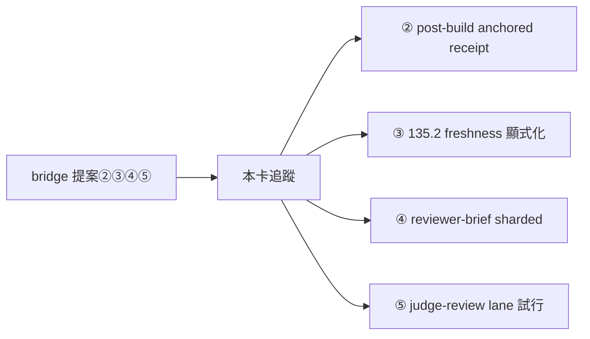
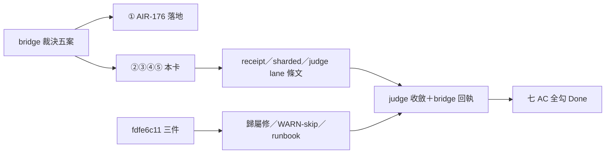

## Description

<!-- SECTION:DESCRIPTION:BEGIN -->
**問題**：bridge 線優化提案（七弧 2.0.28 出貨後的三家族討論合成）五案中，①已由 AIR-176 落地；②③④⑤ 為下一批 instruction 修正——開卡追蹤防遺失（bridge 線信 27e61cc8）。

**這張卡要做**（下一批，不急）：
1. post-build skill：deterministic gates 落 anchored receipt（命令＋git write-tree content hash＋exit code＋輸出摘要）；marshal 只重跑三類（receipt 驗證失敗／非確定性 gate／flaky 嫌疑隔離清單）；收據只豁免重複執行，語義裁決不隨收據轉移。
2. AIR-135.2 freshness rule 一句顯式化：receipt identity 必含 dirty WT content，HEAD-only ≠ fresh（既有判準顯式化非新規——與 AIR-171/175 已接線內容對照後可能僅剩指針微調）。
3. reviewer-brief-template：sharded codex brief 形（開工按檔案/風險分片，per-file depth 歸 codex；muse 恆 full-diff cross-file）＋judge gating rule（reviewer 分歧或高風險面 API/auth/accounting/security 才出動）。
4. judge-review skill：常設 judge lane 折衷試行——定向 resume（帶建立時 --model pin）＋delta packet；turn/token 上限強制換新＋distilled state 交接；每批一弧全新 judge 抽樣對帳漂移；鐵律不動（永不 resume writer 當 judge、逐行裁決附機械證據、sycophancy 否證腿照跑）。

**不做**：bridge 端程式（零程式變更）；①（AIR-176 已落地）。

**驗收**：四項逐項 rg 勾稽＋bridge 線回執確認；落地紀律照 instruction-writing＋review-engine 風險分類。
<!-- SECTION:DESCRIPTION:END -->

## Acceptance Criteria
<!-- AC:BEGIN -->
- [x] #1 ② post-build skill：anchored receipt 條文＋三類重跑清單——rg 可查
- [x] #2 ③ AIR-135.2 freshness rule 顯式化對照 AIR-171/175 後落地（可能僅指針微調）
- [x] #3 ④ reviewer-brief-template：sharded codex 形＋judge gating rule 入範本
- [x] #4 ⑤ judge-review skill：常設 lane 折衷試行條文（鐵律不動）；bridge 線回執確認
- [x] #5 fdfe6c11① rules/bridge-dispatch.md watcher 主路徑行補「ai-guide repo 的」owner 歸屬——rg 可查
- [x] #6 fdfe6c11② wt-open.sh memory pool 缺席時 fallback（WARN-skip 或顯式旗標），不再建 worktree 到一半 exit 3——無 pool repo 實測驗證
- [x] #7 fdfe6c11③ bridge-dispatch skill 收 canonical dispatch runbook（glm writer lane 全命令模板：registry pin 解析→--wt --card 布林→禁 --steps→waiter cwd＝job workspace）——rg 可查
<!-- AC:END -->

## Implementation Plan

<!-- SECTION:PLAN:BEGIN -->
〔baseline：ai-guide 4b49900e〕
〔已決策勿重辯：①bridge 裁決五案中①已由 AIR-176 落地，本卡只做②③④⑤（bridge 線信 27e61cc8；裁決落地 commit 7df053e）；②fdfe6c11 dispatch 歸因三件併入本卡（0923 journal 裁決）——bridge-dispatch 歸屬行級修／wt-open.sh pool 缺席 fallback／dispatch runbook 收斂；③AC#2 對照 AIR-171/175 既有接線後僅做顯式化或指針微調，禁在新位置重刻 freshness 定義（單一源＝ai-development-guide 條2）；④AC#4 judge lane＝折衷試行——定向 resume 帶建立時 --model pin＋turn/token 上限強制換新＋distilled state 交接＋每批一弧全新 judge 抽樣對帳漂移；鐵律不動（永不 resume writer 當 judge、逐行裁決附機械證據、sycophancy 否證腿照跑）〕
範圍：skills/post-build/SKILL.md（AC#1）、ai-development-guide.md 條2＋skills/cr-query＋skills/review-engine 對照點（AC#2）、reviewer-brief 範本住點（worker 先 rg 定位現行 reviewer-brief 落點再動手，AC#3）、skills/judge-review/SKILL.md（AC#4）、rules/bridge-dispatch.md（AC#5）、scripts/wt-open.sh（AC#6）、skills/bridge-dispatch/SKILL.md（AC#7）
驗收：AC#1-7 逐項 rg 勾稽；AC#4 另需 bridge 線回執確認（scbus 寄 bridge-task-marshal）；落地紀律照 instruction-writing＋review-engine 風險分類（gate/contract 面條文語義變更，主 session 補審查腿）
Final Summary 預告：instruction 修正批，user-visible surface＝七處檔面條文（rg 可查）；trivial surface 以 AC 內 rg 命中即樣張，無獨立 mockup。
<!-- SECTION:PLAN:END -->

## Implementation Notes

<!-- SECTION:NOTES:BEGIN -->
【0923 judge 收斂】初輪 judge request-changes 62/100，六項全採納、修正輪落地，marshal rg 直核六點全過（詳 air-177 WT .agent-tmp/air-177-impl-report.md judge 修正輪節）。要點：F1 Critical——AC#7 條文原把 --card 寫成布林，經 pin 2.0.28 binary --help＋bridge-core/task.rs:546-549 機械反證為帶值 <card-id>（--wt 才是布林）；fdfe6c11 歸因信原文措辭有誤，已回報 bridge 線。F2——錨定命令改 git stash create（write-tree 錨 index、post-build 無 staging＝錨空/false-fresh），fail 向 stale 不向 fresh。F3——鍵名 gate_anchors[] 與 review legs 區分。AC#2 裁定 no-change：ai-development-guide.md:51／cr-query:87／review-engine:182 三處 judge 抽驗皆已顯式含 dirty WT/content、HEAD-only≠fresh，補寫即重刻。

【0924 AC#4 收線＋地址勘誤】bridge 回執收訖（delegate-bridge-sess，0deab125）：3 檔 sync 修正驗收落地（我方錯符號名 stored_payg_key_detected 已被糾正為真名 stored_payg_detected）、4 ACTION 全落 main、2.0.30 出版——AC#4 事實面給齊。勘誤：原寄 bridge-task-marshal（5380c19b）未送達——該名稱不在 registry（DB-37 rename 競態，孤兒信箱）；今後 bridge 面信件寄 delegate-bridge-sess（sess_64d6fbf9）。
<!-- SECTION:NOTES:END -->

## Final Summary

<!-- SECTION:FINAL_SUMMARY:BEGIN -->
七 AC 全勾：②anchored receipt／④sharded brief＋judge gating／⑤judge lane＋fdfe6c11 三件落地（f459cabd，judge 收斂）；③對照後 no-change。bridge 回執收訖——經 delegate-bridge-sess（sess_64d6fbf9）queue_next_turn 送達；原寄 bridge-task-marshal（5380c19b）因 DB-37 rename 未送達，地址已糾正。bridge 事實面：3 檔 sync 修正＋4 ACTION 落 main（59f4fcb＋ac7b420）、2.0.30 已出版。

<!-- SECTION:FINAL_SUMMARY:END -->
