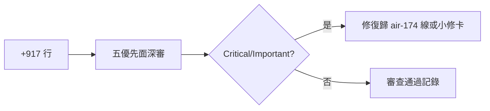
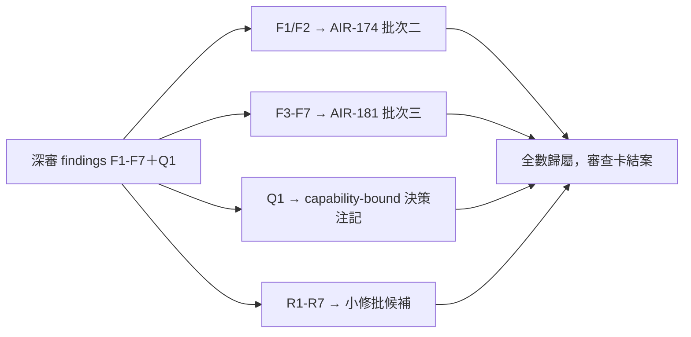

## Description

<!-- SECTION:DESCRIPTION:BEGIN -->
**問題**：governance/install.py 在 164c184c 的 +917 行（3.12 resolver＋三家 registration 投影）——兩輪審查都只抽查 resolve_hook_python，其餘約 800 行無人全讀。安裝器是部署要道（全部 hooks 靠它進三面 config）。

**這張卡要做**：單發深審腿（muse/codex READ-ONLY）覆蓋五優先面——①interpreter resolver（input→path 全路徑、缺 uv/缺 3.12/multi-3.12 的 fail-loud、錯誤指引可操作性）②template renderer（token replacement、quoted command/argv parity）③uninstall/rollback（ownership 對稱、不誤刪 user config、殘留 bare python3 掃描）④三家 parity（CC exec-form／ZCode process／Codex quoted）⑤security（路徑注入、不可信 cwd、--no-python-downloads 繞過面）。

**不做**：不改 install.py（審查卡）；不跑 live 安裝（歸 AIR-179）。

**驗收**：findings 表＋無未處置 Critical/Important＋修復歸屬清單。
<!-- SECTION:DESCRIPTION:END -->

## Acceptance Criteria
<!-- AC:BEGIN -->
- [x] #1 深審腿 findings 表落地（五面覆蓋＋錨點）
- [x] #2 Critical/Important 全數有處置歸屬
<!-- AC:END -->

## Implementation Notes

<!-- SECTION:NOTES:BEGIN -->
【0924 結案處置歸屬】findings 表錨點＝.agent-tmp/air-174-review-639a479b.md＋.agent-tmp/air-135-disc/air178-install-review-result.md。F1（面獨立語義）→AIR-174 批次二（judge 88/100 收斂）；F2（fail-loud 契約）→同上；F3-F7＋後續深挖 →AIR-181 批次三（judge 82/100 收斂）；Q1 codex 覆蓋窄→AIR-181 D decision note（capability-bound＋擴面前置三問）；殘留 R1-R7→小修批候補（AIR-181 卡 notes 全列）。desc 圖 label 語法修（C -->|否|——原 -->否| 渲染炸）。
<!-- SECTION:NOTES:END -->

## Final Summary

<!-- SECTION:FINAL_SUMMARY:BEGIN -->
深審腿收線：findings 表（F1-F7＋Q1）全數有處置歸屬——F1/F2 由 AIR-174 批次二修復收斂（087fc23c）、F3-F7 由 AIR-181 批次三收斂（dd6834e5）、Q1 以 capability-bound decision note 定案（AIR-181 卡 notes）、殘留 R1-R7 記 AIR-181 卡移交小修批。本卡零程式變更（審查卡）。

<!-- SECTION:FINAL_SUMMARY:END -->
