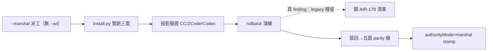

## Description

<!-- SECTION:DESCRIPTION:BEGIN -->
**問題**：AIR-174 結案 Done 時 deployment-surfaces=pending——實機安裝與 firing 未驗，無 owning 卡＝半套。本卡為繼任卡。

**這張卡要做**（以 --marshal 派工執行——兼 DB-33 dogfood）：
1. live 安裝：governance/install.py 實跑，三面投影（CC exec-form／ZCode process／Codex quoted）
2. 投影驗證：三面 config 含新 hooks（kanban-skill-gate／黑話掃描 entry）
3. rollback 演練：uninstall 路徑實跑確認可逆清理→再裝回（終態＝已安裝）
4. live firing：zcode 新 session 實測兩閘

**不做**：不改 install.py 本體（審查歸 AIR-178）。

**驗收**：三面投影正確＋rollback 實證＋firing 記錄；authorityMode=marshal stamp 在 ledger（DB-33 dogfood 副產品）。
<!-- SECTION:DESCRIPTION:END -->

## Acceptance Criteria
<!-- AC:BEGIN -->
- [x] #1 三面投影驗證（CC/ZCode/Codex config 含新 hooks）
- [x] #2 rollback 演練實證可逆＋終態已安裝
- [x] #3 live firing：zcode 新 session 兩閘實測記錄
- [x] #4 authorityMode=marshal stamp 在 ledger（DB-33 dogfood 副產品）
<!-- AC:END -->

## Final Summary

<!-- SECTION:FINAL_SUMMARY:BEGIN -->
**結案（2026-09-23）**：live acceptance 以 --marshal 派工執行（glm Flash，無 --wt＝DB-18 exception dogfood）。四驗證點全 PASS：①ledger authorityMode=marshal stamp（marshal 直查 job 紀錄）②無 WT 可寫 HOME 配置面 ③三面投影正確（CC exec-form 3.12 python／ZCode process+args／Codex quoted）④guards 保留。執行附贈真 finding：uninstall 只移模板形態、legacy bare-python3 條目殘留＋--check 建議路徑與行為不一致——歸 AIR-178 修復清單。--verify 真 firing（block-memory exit 2 deny）；zcode 面 live firing 另有 skill-gate 擋 marshal 建卡事件佐證。codex 面 approve 待 user 手動。

<!-- SECTION:FINAL_SUMMARY:END -->
