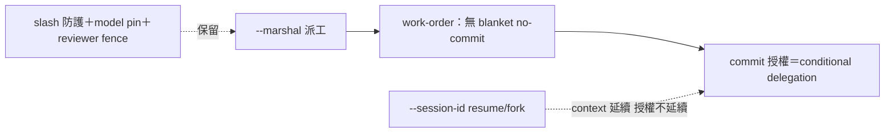

## Description

<!-- SECTION:DESCRIPTION:BEGIN -->
**問題**：DB-33 落地（--marshal 上線）但我方 work-order 範本還有 blanket no-commit 圍欄——能力落地了，caller 工單會把它綁死。

**這張卡要做**：work-order.md 加 marshal mode 條款——--marshal 派工的 writer 工單不帶 blanket no-commit fence，改為「commit 授權依 caller 的 conditional commit delegation（active arc＋有效 post-build receipt＋judge 收斂＋revision 未變）」。不動：correctness guards（slash 防護、model pin）、reviewer READ-ONLY fence（role 語義）。依據：bridge 評估「commit 治理不進 bridge，正確位置是 caller governance」。

**不做**：install.py 審查（AIR-178）；live acceptance（AIR-179）。

**驗收**：work-order.md marshal 條款在場；bridge-dispatch 相關句無矛盾；rg 一致性。
<!-- SECTION:DESCRIPTION:END -->

## Acceptance Criteria
<!-- AC:BEGIN -->
- [x] #1 work-order.md marshal mode 條款在場（no-commit fence 解除改 conditional delegation 指針）——rg 可查
- [x] #2 bridge-dispatch 相關句零矛盾（slash 防護/model pin/reviewer fence 保留聲明）
- [x] #3 dogfood：--marshal 派工實測記錄（ledger stamp＋寫入 parity＋guards 保留）——併 AIR-179 執行
<!-- AC:END -->

## Final Summary

<!-- SECTION:FINAL_SUMMARY:BEGIN -->
**結案（2026-09-23）**：work-order.md marshal mode 條款落地（兩 commit：6221a4e9 本體＋b5b0cc0e codex 修改）。codex 評價腿（--wt --card air-180 --yolo 寫入權）verdict=approve-with-findings——發現 --marshal＋--session-id resume/fork 交互缺口並直接修補（resume 只延續 context 不延續授權；commit 依當次 arc state＋gate evidence 重新成立 conditional delegation）。marshal 條款完整鏈：blanket no-commit 解除→conditional delegation 接管→resume/fork 授權不繼承→guards/reviewer fence 保留。

<!-- SECTION:FINAL_SUMMARY:END -->
