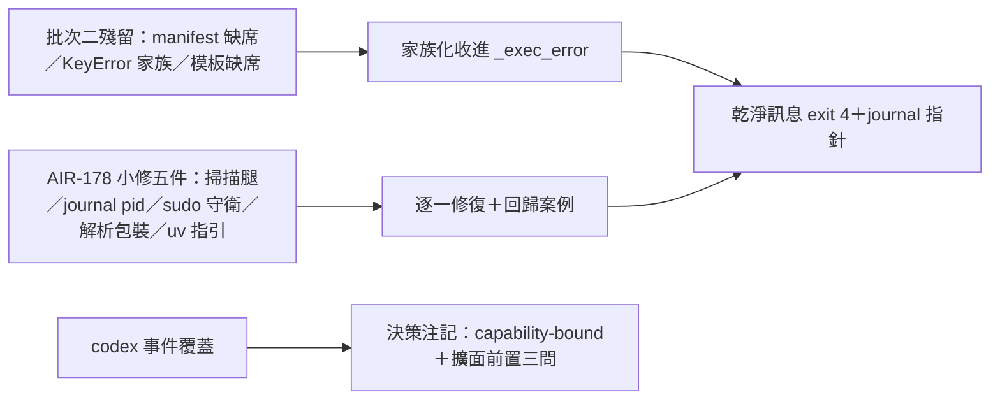

## Description

<!-- SECTION:DESCRIPTION:BEGIN -->
批次二把 install.py 的常見錯誤收進了乾淨契約（exit 4＋可操作指引＋journal 指針），但還有三類漏網：manifest 檔被刪、manifest key 打錯、模板檔不在——這些目前還會裸 traceback。AIR-178 深審另外抓了五個小問題（殘留掃描缺腿、journal 同秒互覆、sudo 下路徑錯位、codex 解析脆弱、缺 uv 訊息沒指引）。

**這卡做什麼**：把上述全部收尾清完，讓 install.py 的錯誤契約一體成型——預期失敗一律乾淨訊息 exit 4，程式 bug 照樣大聲崩。另補一則 codex 事件覆蓋的決策注記（為何現階段不擴面）。

**不做什麼**：不動 codex 模板事件覆蓋（決策注記只記 rationale 與擴面前置問題）；不做 AIR-178 審查卡本身的收結。

**規矩**：每個修復先寫失敗測試再實作；F3（殘留掃描）與 F5（sudo 守衛）是語義變更，卡 notes 先記規格裁定再動手。

<!-- SECTION:DESCRIPTION:END -->
