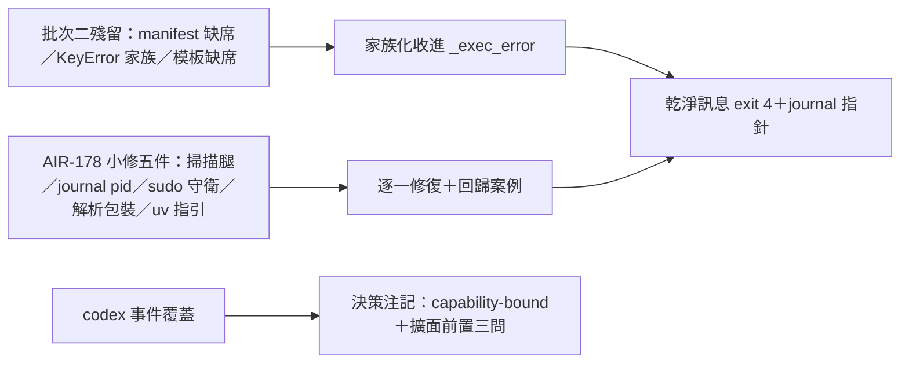

## Description

<!-- SECTION:DESCRIPTION:BEGIN -->
批次二把 install.py 的常見錯誤收進了乾淨契約（exit 4＋可操作指引＋journal 指針），但還有三類漏網：manifest 檔被刪、manifest key 打錯、模板檔不在——這些目前還會裸 traceback。AIR-178 深審另外抓了五個小問題（殘留掃描缺腿、journal 同秒互覆、sudo 下路徑錯位、codex 解析脆弱、缺 uv 訊息沒指引）。

**這卡做什麼**：把上述全部收尾清完，讓 install.py 的錯誤契約一體成型——預期失敗一律乾淨訊息 exit 4，程式 bug 照樣大聲崩。另補一則 codex 事件覆蓋的決策注記（為何現階段不擴面）。

**不做什麼**：不動 codex 模板事件覆蓋（決策注記只記 rationale 與擴面前置問題）；不做 AIR-178 審查卡本身的收結。

**規矩**：每個修復先寫失敗測試再實作；F3（殘留掃描）與 F5（sudo 守衛）是語義變更，卡 notes 先記規格裁定再動手。

<!-- SECTION:DESCRIPTION:END -->

## Implementation Plan

<!-- SECTION:PLAN:BEGIN -->
〔baseline：ai-guide ac5b34bb〕
〔已決策勿重辯：①開卡形態＝新實作卡（AIR-174 Done 不重開；muse/codex 討論 0924，_exec_error 行為定義以本卡為單一源）；②F-A 補收斂不注釋凍結——manifest 缺席 FileNotFoundError／surfaces+registrations 其餘 KeyError 家族／模板檔缺席，家族化收進 _exec_error；邊界＝只收預期 artifact/config lookup 失敗，禁全域 catch（codex 條件）；build_plan 階段失敗 journal_hint=False（muse 條件，防 F-F 誤導）；③F-E 清 dead assignment＋兩處不可達 rc 檢查，契約＝apply_plan 回 OK 或 raise 永不回非零，限同區禁擴面；④F6 byte-parity 禁重排；⑤F3/F5 語義變更規格先行——卡 notes 記規格裁定再動手；⑥D 採 decision note（capability-bound rationale＋擴面前置三問：sensor 消費者／FileChanged 對應／compact 轉譯），不開調查卡不擴事件；⑦AIR-178 卡不變實作卡〕
範圍：governance/install.py＋tests/＋AIR-181 卡 notes；執行序＝F-A/F-F/F-E 同批→F7+F4→F6→F3+F5→D note
驗收：每實例 RED→GREEN 回歸案例＋全量 pytest＋ruff＋L4 行為聲明（F3/F5 語義變更顯式列出）
<!-- SECTION:PLAN:END -->

## Acceptance Criteria
<!-- AC:BEGIN -->
- [ ] #1 F-A 收斂：manifest 缺席 FileNotFoundError／surfaces+registrations 其餘 KeyError 家族／模板檔缺席 → _exec_error（EXIT_EXEC(4)；build_plan 階段 journal_hint=False；邊界＝預期 lookup 失敗，禁全域 catch）——每實例回歸案例
- [ ] #2 F-E：dead assignment exit_code＋兩處不可達 rc 檢查移除＋契約測試（apply_plan 回 EXIT_OK 或 raise，永不回非零）
- [ ] #3 F7 缺 uv 訊息補安裝指引＋F4 journal 檔名加 pid（仿 backup_target 形態；prune 仍按 mtime）
- [ ] #4 F6 codex_group_units：per-unit tomllib.loads 包 GovernanceError＋縮排 header 行為立約（byte-parity 禁重排）
- [ ] #5 F3 codex 面 JSON 殘留掃描＋F5 sudo/HOME 守衛——語義變更，規格裁定先記卡 notes
- [ ] #6 D decision note：codex 覆蓋 capability-bound rationale＋擴面前置三問記卡 notes
- [ ] #7 全量 pytest＋ruff 綠＋L4 行為聲明（F3/F5 語義變更顯式列出）
<!-- AC:END -->
