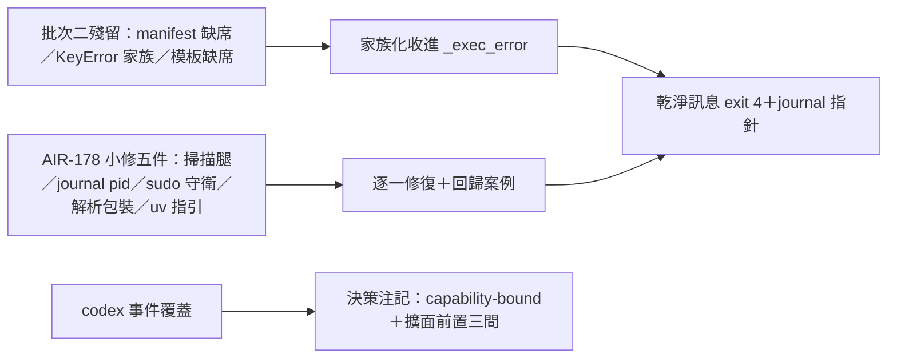
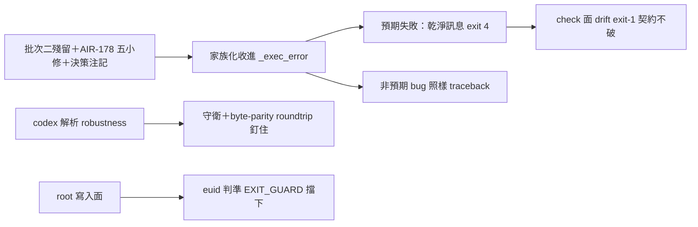

## Description

<!-- SECTION:DESCRIPTION:BEGIN -->
批次二把 install.py 的常見錯誤收進了乾淨契約（exit 4＋可操作指引＋journal 指針），但還有三類漏網：manifest 檔被刪、manifest key 打錯、模板檔不在——這些目前還會裸 traceback。AIR-178 深審另外抓了五個小問題（殘留掃描缺腿、journal 同秒互覆、sudo 下路徑錯位、codex 解析脆弱、缺 uv 訊息沒指引）。

**這卡做什麼**：把上述全部收尾清完，讓 install.py 的錯誤契約一體成型——預期失敗一律乾淨訊息 exit 4，程式 bug 照樣大聲崩。另補一則 codex 事件覆蓋的決策注記（為何現階段不擴面）。

**不做什麼**：不動 codex 模板事件覆蓋（決策注記只記 rationale 與擴面前置問題）；不做 AIR-178 審查卡本身的收結。

**規矩**：每個修復先寫失敗測試再實作；F3（殘留掃描）與 F5（sudo 守衛）是語義變更，卡 notes 先記規格裁定再動手。

<!-- SECTION:DESCRIPTION:END -->

## Acceptance Criteria
<!-- AC:BEGIN -->
- [x] #1 F-A 收斂：manifest 缺席 FileNotFoundError／surfaces+registrations 其餘 KeyError 家族／模板檔缺席 → _exec_error（EXIT_EXEC(4)；build_plan 階段 journal_hint=False；邊界＝預期 lookup 失敗，禁全域 catch）——每實例回歸案例〔0925 代勾：實作在場 governance/install.py:52,81-92,323,329（_exec_error/EXIT_EXEC/journal_hint）；commit dd6834e5〕
- [x] #2 F-E：dead assignment exit_code＋兩處不可達 rc 檢查移除＋契約測試（apply_plan 回 EXIT_OK 或 raise，永不回非零）〔0925 代勾：dd6834e5 F-E 清理〕
- [x] #3 F7 缺 uv 訊息補安裝指引＋F4 journal 檔名加 pid（仿 backup_target 形態；prune 仍按 mtime）〔0925 代勾：dd6834e5〕
- [x] #4 F6 codex_group_units：per-unit tomllib.loads 包 GovernanceError＋縮排 header 行為立約（byte-parity 禁重排）〔0925 代勾：dd6834e5〕
- [x] #5 F3 codex 面 JSON 殘留掃描＋F5 sudo/HOME 守衛——語義變更，規格裁定先記卡 notes〔0925 代勾：dd6834e5＋結案 notes〕
- [x] #6 D decision note：codex 覆蓋 capability-bound rationale＋擴面前置三問記卡 notes〔0925 代勾：卡 notes＋6e2f955d 結案〕
- [x] #7 全量 pytest＋ruff 綠＋L4 行為聲明（F3/F5 語義變更顯式列出）〔0925 代勾：結案流 6e2f955d Final Summary 齊——前 session 實作與結案真、勾格漏tick，本批補齊〕
<!-- AC:END -->

## Implementation Plan

<!-- SECTION:PLAN:BEGIN -->
〔baseline：ai-guide ac5b34bb〕
〔已決策勿重辯：①開卡形態＝新實作卡（AIR-174 Done 不重開；muse/codex 討論 0924，_exec_error 行為定義以本卡為單一源）；②F-A 補收斂不注釋凍結——manifest 缺席 FileNotFoundError／surfaces+registrations 其餘 KeyError 家族／模板檔缺席，家族化收進 _exec_error；邊界＝只收預期 artifact/config lookup 失敗，禁全域 catch（codex 條件）；build_plan 階段失敗 journal_hint=False（muse 條件，防 F-F 誤導）；③F-E 清 dead assignment＋兩處不可達 rc 檢查，契約＝apply_plan 回 OK 或 raise 永不回非零，限同區禁擴面；④F6 byte-parity 禁重排；⑤F3/F5 語義變更規格先行——卡 notes 記規格裁定再動手；⑥D 採 decision note（capability-bound rationale＋擴面前置三問：sensor 消費者／FileChanged 對應／compact 轉譯），不開調查卡不擴事件；⑦AIR-178 卡不變實作卡〕
範圍：governance/install.py＋tests/＋AIR-181 卡 notes；執行序＝F-A/F-F/F-E 同批→F7+F4→F6→F3+F5→D note
驗收：每實例 RED→GREEN 回歸案例＋全量 pytest＋ruff＋L4 行為聲明（F3/F5 語義變更顯式列出）
<!-- SECTION:PLAN:END -->

## Implementation Notes

<!-- SECTION:NOTES:BEGIN -->
【0924 judge 收斂＋殘留移交】judge approve-with-findings 82/100→六項修正收斂：F-1 check live-side 收 drift（保 M3 exit-1 契約＋面獨立掃描）；F-2 journal_hint 透傳（merge/apply True、check/probe False）＋JOURNAL_DIR 缺席斷言；F-3 root 守衛改 euid==0 判準（跨平台，HOME 比對刪除——spec 原條件 macOS /var/root 失效，judge 抓出）；F-4 probe_codex registrations＋check reg 欄位 target/template 補收；F-5 isinstance 前檢（拒 except 擴充防吞 downstream bug）；F-6 manifest exit_codes 枚舉補 root euid 守衛（主 session 落）。

【D decision note——codex 事件覆蓋】capability-bound：現覆蓋（PreToolUse-Bash/apply_patch、SessionEnd、Stop）＝mutation/lifecycle 執法面先行，sensor/compact 缺席非 bug。擴面前置三問：①sensor --source codex 有無消費者②FileChanged 無對應事件的轉譯③compact 用 PreCompact 或沿 SessionStart——trust hash-pinned＋positional state key，盲目加 group 觸 trust churn。

【殘留清單移交小修批】R1 install rules/agents/memory argv 面 surfaces/registrations 直取（約 L1267/1276-1304）；R2 check_agents_face（約 L1778）；R3 json 面型別逃逸盤點；R4 同 pid 同秒同 surface journal 互覆（資訊性）；R5 tests/ 19 既有 ruff findings；R6 dry-run rules/agents argv 同款；R7 codex_group_units 縮排 header 支援立約（現守衛擋）。
<!-- SECTION:NOTES:END -->

## Final Summary

<!-- SECTION:FINAL_SUMMARY:BEGIN -->
批次三收斂：F-A 家族化收進 _exec_error（manifest 缺席／KeyError 家族／模板缺席→exit 4 乾淨訊息，禁全域 catch）；F-E dead 清理＋契約測試；AIR-178 五小修（uv 指引／journal pid／parser 守衛 byte-parity／殘留掃描／root euid 守衛）；judge 修正輪收斂（check live-side drift 保 M3、journal_hint 透傳、probe＋registration 補收）。全量 2127 passed、judge 82/100 approve-with-findings 收斂。殘留 R1-R7 移交小修批（卡 notes）。

<!-- SECTION:FINAL_SUMMARY:END -->
