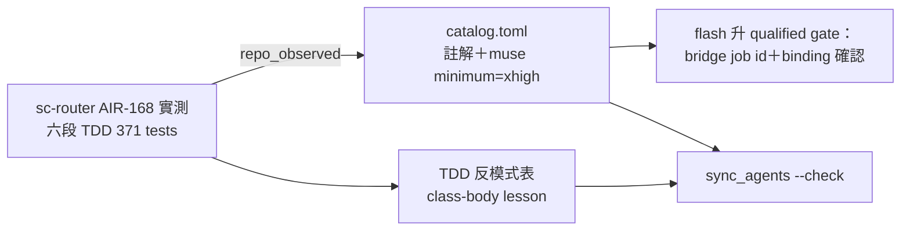

## Description

<!-- SECTION:DESCRIPTION:BEGIN -->
把 sc-router AIR-168 位址制弧（2026-09-23，per-segment TDD 六段全綠）的 carrier 實測證據沉澱進 ai-guide：catalog 補 qualification 證據註解＋一條 class-body scoping lesson 進 TDD 反模式表。tri 三腿 OK-with-changes 後開卡（user 0924 預授權「OK 就開卡」）。

**做什麼**

- catalog.toml `implement_from_accepted_ep` 附近補註解行：①codex-web 寫測試失敗＝工單形狀錯（既有 webgpt 內聯規則可預測的實例，**不記 unqualified**——judge 裁決）②muse xhigh 三檔 1735 行零 skip→記錄加 `minimum_effective_effort="xhigh"`＋caveats 註解 ③GLM-5.3 adjudication 已 qualified scope=\*——corroboration 以註解指針承載
- flash `implement_from_accepted_ep` **維持 conditional**：升 qualified 的 gate＝找到 sc-router 弧 implement 段 bridge job id 且 binding=bridge-glm-5.3-flash（順帶對帳 SKILL:122 定義源防 drift）
- test-driven-development SKILL「測試反模式自檢」表加一行：class body 不捕獲函式 scope——外部家族寫 pytest helper 以 factory 函式或 kwargs 注入（muse S3 四紅根因）；prose-strip caveat 併同行後半
- `sync_agents.py --check` 驗 schema

**不做什麼**

- 不新增 write_tests workload token（tri 三腿一致）
- codex-web 不記 unqualified（超證據外推）
- 不立新 skill、不新開 lesson 檔

<!-- SECTION:DESCRIPTION:END -->

## Acceptance Criteria
<!-- AC:BEGIN -->
- [ ] #1 #1 catalog.toml implement_from_accepted_ep 附近補三筆註解行（codex-web 寫測試失敗＝webgpt 內聯規則可預測的工單形狀錯實例——不記 unqualified；muse caveats：class-body 陷阱＋prose-strip；GLM-5.3 adjudication corroboration 指針）＋muse-spark-1.3 記錄加 minimum_effective_effort="xhigh"
#2 flash implement_from_accepted_ep 維持 conditional——升 qualified gate＝sc-router 弧 implement 段 bridge job id 在手且 binding=bridge-glm-5.3-flash（找到→升＋binding_scope 補 bridge-glm-5.3-flash＋SKILL:122 定義源對帳；找不到→只補註解並記 residue）
#3 test-driven-development SKILL「測試反模式自檢」表加一行：class body 不捕獲函式 scope——外部家族寫 pytest helper 以 factory 函式或 kwargs 注入（prose-strip caveat 併同行後半或明示放棄）
#4 uv run python scripts/sync_agents.py --check exit 0；數字錨定 jobid＋檔案（371 tests 以 completion-report 為準，禁 prose 計數）
#5 約束區（entry 六欄——user packet＋tri 收斂 0924）：intent verbatim＝「把 sc-router AIR-168 位址制弧（2026-09-23）的 carrier 實測證據，落進 model-routing catalog 的 qualification 記錄＋一條 test-writing 陷阱 lesson」；non-goals＝不新 skill／不新 workload token／codex-web 不記 unqualified／不新開檔；revert 敞口帽＝catalog/TDD git 可逆 3 輪；預授權類＝backlog metadata 例外①②、catalog/TDD 變更走卡 branch＋bi 審查＋post-build 過關直行；成功謂詞＝AC#1-#4
<!-- AC:END -->

## Implementation Plan

<!-- SECTION:PLAN:BEGIN -->
〔baseline：ai-guide $HEAD（main）〕

〔已決策勿重辯（tri 三腿 muse/codex/GLM-5.3 全收斂＋judge 裁決 0924；receipt＝.agent-tmp/air-135/air168-tri-{muse,codex,glm}.md）〕①不新 write_tests workload token（enum 雙寫點盤點：catalog:26-33 權威＋SKILL glossary:22 無機械對帳＋tests fixture :555-562）②codex-web 不記 unqualified——失敗＝工單形狀錯（webgpt 內聯規則實例），記錄屬超證據外推 ③flash 維持 conditional 至 carrier＋binding 確認（SKILL:122 升級條件寫死 skill 文字＝定義源，catalog 單方面升即 drift）④lesson 一行進 TDD「測試反模式自檢」表 ⑤prose-strip 查無既有慣例——併 lesson 行或明示放棄 ⑥數字勘誤：371 tests（非 372）；行數錨 jobid/檔 ⑦開卡依 user 0924「OK 就開卡」預授權＋tri OK-with-changes

〔範圍〕動＝skills/model-routing/catalog.toml（註解＋muse minimum_effective_effort）、skills/test-driven-development/SKILL.md（反模式表一行）、（AC#2 gate 過時）catalog flash 記錄＋SKILL:122 對帳；不動＝schema／enum／workload、SKILL glossary、agents/presets.toml

〔證據指針〕對端＝sc-router repo 00-tasks/2026-09/09-23-scbus-位址制/completion-report.md＋.agent-tmp/tri-{muse,codex,glm}-result.md；本側 tri receipt＝.agent-tmp/air-135/air168-tri-{muse,codex,glm}.md

〔規模分級〕simple~standard——資料層編輯＋一行 lesson，零新 boundary
<!-- SECTION:PLAN:END -->
