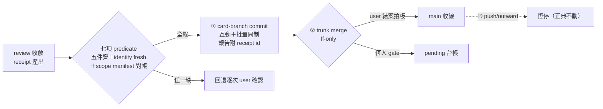
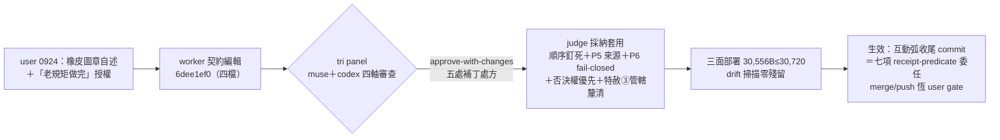

## Description

<!-- SECTION:DESCRIPTION:BEGIN -->
互動 session 每弧收尾 commit 逐次等 user，但 user 0924 自述實務已橡皮圖章（沒看就同意）——gate 只剩摩擦、無驗證價值。三家族討論（muse/codex/GLM-5.3，0924，receipts＝.agent-tmp/air-135/commitgate-{muse,codex,glm}.md）收斂：user 判斷在 scope 面成立——WT/branch 隔離＋receipt freshness＋preflight 已消化「防部分處理」的原始價值；放寬①card-branch commit 為 receipt-predicate 條件委任（互動＋autonomous 同制、五件齊即 commit、一 receipt 一 commit）；②trunk merge（ff-only）恆人 gate＝結案拍板點（intent 層最後人檢在此落位）；③push/outward 恆停。

**不做什麼（worker 擋關全不動——它們管 writer 越權，非 marshal commit 授權）**：delegate-bridge SOP 驗收閘（#2 越權即拒收）、write 腿 git sandbox 弧（#1 候補——放寬後更重要）、marshal_admission_guard work-order 憑證（SC-199.1）、AIR-135.8 派工前執法、工單 brief 紅線（禁 git）、board single-writer、wt-close preflight、control-plane-guard。

**背景事實**：DB-41 muse writer 越權三連（0924 delegate-bridge f951c83 記帳＋C 裁定）——muse 腿越權 commit／自跑 post-build／自行標 Done；本卡放寬範圍明文限 marshal 主 session commit 授權，worker 面 fence 一律不碰（user「不一貫」疑慮的對答案）。
<!-- SECTION:DESCRIPTION:END -->

## Acceptance Criteria
<!-- AC:BEGIN -->
- [x] #1 rules Commit 段 delegation 適用面改 session-agnostic＋三層邊界宣告（①receipt-predicate 委任／②merge 恆人 gate／③push 恆停）；一次授權≠永久授權正典不動（rg 驗證）
- [x] #2 skills/commit/SKILL.md：conditional delegation 去 autonomous-only＋新增互動 receipt-gate 驗收程序節（七項 predicate 逐項：active arc／receipt verdict ok／legs 收斂零 open／identity fresh／scope manifest 對帳／🔴高風險例外／commit 後 head_sha 刷新＋receipt id 記帳）
- [x] #3 投影三處同步：skills/deep-work/SKILL.md『/commit 等 user 確認』drift 行修復＋repo AGENTS.md git 慣例收尾條三層邊界明文＋skills/kanban-board/SKILL.md 結案兩步節 merge 授權點對齊
- [x] #4 drift 掃描：rg『conditional commit delegation』＋rg『等 user 確認』全 repo 逐檔對帳，零落後投影殘留（掃描輸出落卡 notes）
- [x] #5 落地前審查閘（boundary 級全套）：worker diff 經 fresh＋intent 分離腿＋跨家族 muse/codex external second-opinion（tri panel）——verdict 記卡；回執四欄（classification/review/session-freshness/deployment-surfaces）入 notes；有不確定＝tri 開會（user 0924 指令）
- [x] #6 部署對帳：deploy_agents.py 三面 bundle 重部署（muse 面 byte≤30,720）＋session freshness 注記（生效後新 session 重讀）；memory commit-consent-in-autonomous-mode 蒸餾更新（歷史裁定鏈保留）
<!-- AC:END -->

## Implementation Plan

<!-- SECTION:PLAN:BEGIN -->
〔baseline：ai-guide main（1a439ff9+）〕

〔已決策勿重辯（tri 三腿全收斂 OK-with-changes 0924；receipts＝.agent-tmp/air-135/commitgate-{muse,codex,glm}.md；user 橡皮圖章自述 0924 為實證補強）〕①放寬形態＝receipt predicate 非散文「review 過關」（glm R6：散文形態＝NO）②放寬僅及①card-branch commit；②merge＝結案拍板點恆人 gate；③push/outward 恆停（三腿矩陣全同）③互動與批量同制（消除「批量更自動、互動更嚴」倒掛）④worker 面 fence 全不動（DB-41 對案）

〔七項機械清單（commit 前逐項驗，任一缺回退逐次確認）〕1. active arc：branch 卡 id→status In Progress 2. receipt 存在且 post-build gate --verdict ok（stale/missing 無效）3. required review legs 全 terminal＋judge/followup 收斂零 open 4. identity fresh：git status 空＋HEAD==receipt.head_sha（後續變更→delta review 重產 receipt）5. staged 逐檔對照卡 scope manifest 6. 機械例外①-④照舊；🔴高風險弧仍人確認 7. commit 後刷新 receipt head_sha＋報告附 receipt id（授權依據＝predicate 成立，契約明文）

〔契約落點（定義源→投影逐一同步）〕A. rules/outward-action-consent.md Commit 段：delegation 適用面 autonomous→session-agnostic＋三層邊界宣告 B. skills/commit/SKILL.md：conditional delegation 去 autonomous-only＋階段 5 receipt-gate 替代路徑 C. skills/deep-work/SKILL.md：「/commit 等 user 確認」行已落後於 rule（glm 發現 drift）——同步為 pointer D. repo AGENTS.md git 慣例收尾條：三層邊界明文 E. skills/kanban-board/SKILL.md 結案兩步節：merge 授權點對齊

〔落地前審查閘（boundary 級全套）〕非 static-only；review 腿＝fresh＋intent 分離＋跨家族 external second-opinion（tri panel——放寬授權屬高影響面）；回執四欄入卡 notes（classification/review/session-freshness/deployment-surfaces）；隔離 authoring（card WT）；drift 防護＝改後 rg「conditional commit delegation」＋rg「等 user 確認」逐檔對帳；memory commit-consent-in-autonomous-mode 蒸餾更新（歷史裁定鏈保留）；部署後 session freshness（重讀）。

〔規模分級〕standard——authorization 語義變更、跨五檔契約同步；無新 boundary 決策（三腿已收斂方向）。
<!-- SECTION:PLAN:END -->

## Implementation Notes

<!-- SECTION:NOTES:BEGIN -->
【0924 user 開工指令】『這件事很重要，好好跟 muse codex 討論，有不確定就 tri 開會…commit 這件事也是老規矩做完』——執行約束：所有判斷類未決經 tri（muse+codex+5.3）收斂；boundary 審查閘 tri panel 即此形態。

【0924 tri panel 審查＋judge 收斂】muse/codex 雙腿 approve-with-changes（receipts＝.agent-tmp/air-135/air183-review-{muse,codex}.md）；judge 採納五處補丁全數套用：七項驗證順序釘死＋P5 manifest 機械來源與缺失 fail（codex 同源 Minor 併入）＋P6 🔴分類 fail-closed＋user 否決權恆優先＋kanban 特赦③管轄面釐清（真衝突必修——兩制管轄面互斥：metadata commit 走特赦③、code commit 走 receipt-gate）。residue 記錄：①post-build :28/:237/:251＋autonomous-execution :41/:48/:50『autonomous 唯一例外』×6——嚴於新制非破口，記後續對齊項 ②manifest 過寬非機械可判（codex 軸④）——由 review receipt scope 確認＋晨間否決承接。【回執四欄】classification=boundary（authorization 語義）；review=tri panel（muse/codex external second-opinion＋GLM-5.3 judge，approve-with-changes 收斂）；session-freshness=bundle 已重部署＋freshness 注記（生效後新 session 重讀 outward rule）；deployment-surfaces=3/3（muse 30,556B≤30,720 gate＋zcode＋codex 面 session-agnostic 投影驗證）。
<!-- SECTION:NOTES:END -->

## Final Summary

<!-- SECTION:FINAL_SUMMARY:BEGIN -->
as-built 終態圖：

Final Summary：AIR-183 落地＝互動 session 弧收尾 commit 從逐次確認改為 receipt-predicate 條件委任（session-agnostic 與批量同制）；三層邊界釘死（card-branch commit 委任／trunk merge＝結案拍板點恆 user gate／push 恆停）；worker 面 fence（DB-41 對案）零觸碰。審查鏈＝tri panel approve-with-changes→五處補丁套用→3/3 面部署＋drift 掃描零殘留。residue：『autonomous 唯一例外』×6（post-build＋autonomous-execution）記後續對齊；manifest 過寬極限記卡；kanban 特赦③管轄面已釐清併入本弧。merge 回 main 由 marshal 收線執行（老規矩）。
<!-- SECTION:FINAL_SUMMARY:END -->
