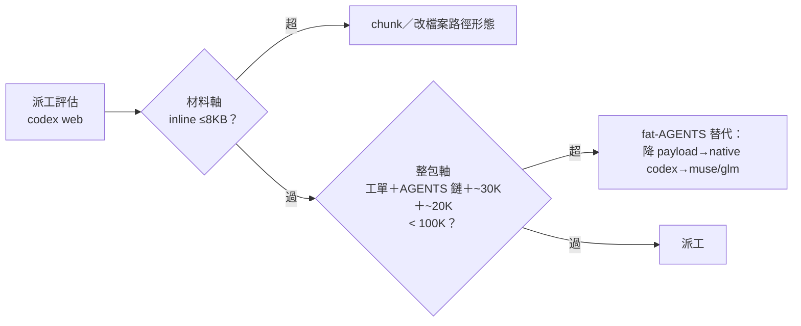

## Description

<!-- SECTION:DESCRIPTION:BEGIN -->
delegate-bridge 0924 調查弧（sess_d6e3e495，southchariot codex web 三連敗）收斂出新邊界：死亡線 [~100K, ~126K] composer chars；核心教訓「工單小≠payload 小」（composer＝CLI 序列化整包＝工單＋AGENTS.md 鏈＋全域 ~30K＋buffer ~20K；實例 3KB 工單在 fat-AGENTS repo 仍落 126K）。本卡把 ai-guide 側派工指引寫齊四要素：預算值、envelope 口徑、估算式、替代路由。muse＋codex 討論雙腿收斂（receipts＝.agent-tmp/air-135/webgpt-{muse,codex}.md）：雙軸命名分離——材料軸（≤8KB inline，09-16 既有）vs 整包軸（composer <100K），禁共用「上限/安全線」一詞。

**不做什麼**：不動 delegate-bridge 側（其 AGENTS.md webgpt 段來源弧已更新）；不把實測值升格永久規格（CLI drift 觀察項承載）；不開架構工程（純文檔釐清）。
<!-- SECTION:DESCRIPTION:END -->

## Implementation Plan

<!-- SECTION:PLAN:BEGIN -->
〔已決策勿重辯（muse＋codex 雙腿收斂 0924）〕①載體分配：預算值一行進 rules/bridge-dispatch.md（always-on gate 數字）；envelope 口徑＋估算式＋雙軸表述＋fat-AGENTS 判準與替代順序＋觀察項住 skills/bridge-dispatch/SKILL.md webgpt 節（單一源）；model-routing codex row 只加一行指針（不持 payload 數字）②雙軸命名：材料軸（≤8KB inline）／整包軸（composer <100K＝工單＋repo AGENTS 鏈＋全域 ~30K＋buffer ~20K）——每軸各寫量什麼＋超了怎麼辦 ③fat-AGENTS：判準以估算式為準（repo AGENTS ≳50K 進估算參考錨）；順序＝降 payload（檔案路徑/chunk）→native codex→muse/glm→in-harness ④觀察項三筆（CLI 注入量 drift as-of 標記／buffer 漂移／回應段死×整包交互）進 skill webgpt 節末 bullet，不進 rule；可選 dispatch 前 wc -c AGENTS.md 記 residue

〔範圍〕動＝rules/bridge-dispatch.md（一行）、skills/bridge-dispatch/SKILL.md（webgpt 節）、skills/model-routing/SKILL.md（codex row 一行指針）；不動＝delegate-bridge repo、daemon 源碼歸因

〔落地前審查閘分類〕ordinary（dispatch 程序指引非 authorization 語義）；驗收＝四要素齊＋rg 舊數字掃描＋單一源無雙寫

〔規模分級〕simple~standard——三檔文檔編輯
<!-- SECTION:PLAN:END -->
