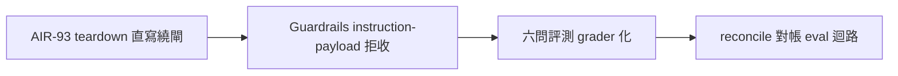

## Description

<!-- SECTION:DESCRIPTION:BEGIN -->
來源：cookbook r2 治理六面共識第二項（0925 晨間合議⑤定案開卡——兩腿一致第一名；判準＝AIR-93 session-end bypass 真事故背書）。

範圍候選：① memory 寫入面 Guardrails——instruction-shaped payload 拒收（AIR-93 教訓的評測化收尾）② 記憶品質 eval 資產——六問評測可機械 grader 化 ③ reconcile_memory_pool.py 對帳 eval 迴路接入。載體路由與規格＝開工時經 execution-plan 分級；候補池入口非承諾排程。

## Acceptance Criteria
- [ ] #1 Guardrails instruction-payload 拒收規則經 probe 實證（AIR-93 案例重放）
- [ ] #2 eval grader 對既有池樣本跑通（precision/recall 首批數字）
- [ ] #3 reconcile 迴路接入點定義＋掛點測試
<!-- SECTION:DESCRIPTION:END -->
