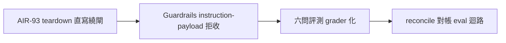

## Description

<!-- SECTION:DESCRIPTION:BEGIN -->
來源：cookbook r2 治理六面共識第二項（0925 晨間合議⑤定案開卡——兩腿一致第一名；判準＝AIR-93 session-end bypass 真事故背書）。

範圍候選：① memory 寫入面 Guardrails——instruction-shaped payload 拒收（AIR-93 教訓的評測化收尾）② 記憶品質 eval 資產——六問評測可機械 grader 化 ③ reconcile_memory_pool.py 對帳 eval 迴路接入。載體路由與規格＝開工時經 execution-plan 分級；候補池入口非承諾排程。

## Acceptance Criteria
- [ ] #1 Guardrails instruction-payload 拒收規則經 probe 實證（AIR-93 案例重放）：規則 v0 落檔（黑訊號表＋白豁免表＋≥20 正反例 golden；起手先對照 AIR-49 已落地「注入安全」條 011d420，增量顯式化）；AIR-93 合成重放下 reconcile exit 2 照常檢出且規則 recall=100%、golden 白例零誤擋；tool 路徑高精度子集進 hook＋consolidation 側終判條文（控制面弧， Slice 1b）
- [ ] #2 eval grader 對既有池樣本跑通（precision/recall 首批數字）：scripts/memory_evals.py＋版控 golden ≥50 條（inbox done/rejected＋池抽樣人工標註＋adversarial 正例）；per-維度 P/R 落檔，Q1 誤殺率單列；self-grade 禁作 oracle（golden 權威＝人工 adjudication）。驗證式：memory_evals.py --golden 全綠＋數字落檔
- [ ] #3 reconcile 迴路接入點定義＋掛點測試：掛點＝preflight exit 2 分支（checks.pool_delta.entries 唯一輸入源）；quarantine 清單逐檔帶分流標籤；合成三類-delta fixture 測試；exit 0/1/2 契約零漂移。驗證式：fixture pytest 綠＋reconcile 原契約測試未動全綠
<!-- SECTION:DESCRIPTION:END -->

## Implementation Notes

<!-- SECTION:NOTES:BEGIN -->
【0925 tri 研究開卡轉正式（muse job-mugqmxl7 TRI SPEC ready＋glm 考古；codex auth-failed deferred）】①覆蓋度修正：glm 考古證明「注入安全」條已由 AIR-49 落地（011d420，0924 比本卡早、與 cookbook 兩源獨立收斂）——AC#1 起手對照防重刻。②muse 規格採用：載體路由＝tool 路徑高精度子集 hook（三判準全過）／廣譜判定終判 skill（memory-audit Inbox 消費）／eval=script＋golden 資料檔／接線=script 改動；原則「閘快拒、審終判」；golden 權威＝人工 adjudication（self-grade 禁作 oracle）。③切分＝三 slice（S1 規則 v0＋golden 20＋AIR-93 重放→S2 grader 全量→S3 reconcile 掛點；S1b 控制面 hook+條文另弧 instruction gate）；每 slice standard 下限。④起手確認項：preflight 是否 shell-out reconciler（EP 起手式）。⑤實作走老規矩（flash implement→post-build 雙腿→5.3 judge→commit→新制 merge）。S1 已派。
<!-- SECTION:NOTES:END -->
