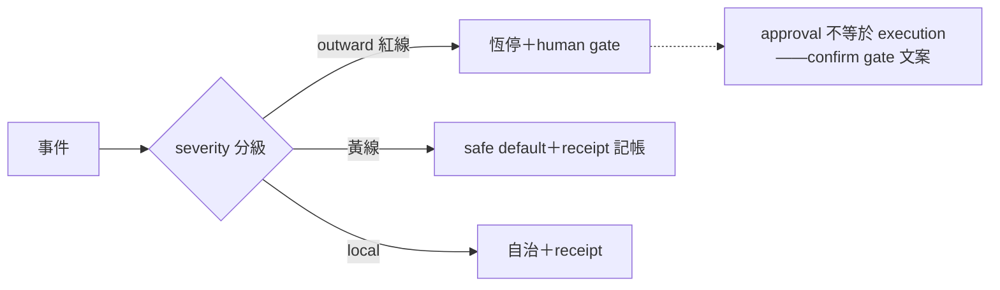
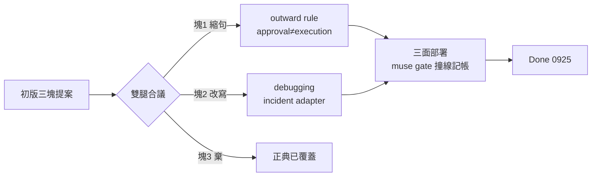

## Description

<!-- SECTION:DESCRIPTION:BEGIN -->
來源：cookbook r2 治理六面共識第五項（0925 晨間合議⑤——muse 腿第二名；判準＝outward 憲法級＋0924 授權語義真摩擦：quote-scope 判準的運維化）。

範圍候選：①sev 分級表（outward 紅黃線對齊 outward-action-consent）②approval 不是 execution 句式導入 confirm gate 文案③事故回覆 runbook 樣板（對應 debugging-and-error-recovery）。動 outward 面條文須走 instruction-writing 落地前審查閘。候補池入口非承諾排程。

## Acceptance Criteria
- [x] #1 sev 分級表草案（對齊 outward-action-consent 紅黃線）——**裁定不另刻**：雙腿合議（muse NO-GO 論證＋codex GO-WITH-CHANGES）確認紅黃線是「無人執行 decision boundary」非 incident severity，第二張表必 drift 且與紅線表衝突（docker stop/revert 例）；單一源保留＝autonomous-execution，debugging 只做 incident adapter 薄指針
- [x] #2 confirm gate 文案 approval 不是 execution 句式修訂（走審查閘）——**✓ 0925**：outward rule:13 approval≠execution 縮句（codex 版：AUTH 只滿足該具體 action 的 consent gate，不豁免自身其他 gate、不延伸後續 action）；雙腿審（muse NO-GO 逐塊論證＋codex GO-WITH-CHANGES——合議改寫版即落地內容；job id 見 Implementation Notes 尾）
- [x] #3 runbook 樣板入 debugging skill（或另立）——**✓ 0925**：debugging skill「事故回覆 Incident Adapter」節（調查先行／處置過既有 gate／proposal≠execution／provenance 標記；merge e5c90db4）
- [x] #4（合議衍生）skills≠credentials 供應鏈審查——**棄收**：documentation≠authorization 已正典化（outward rule:29），重刻違 single-source；第三方 skill trust boundary 拆出另覓落點（候補）
<!-- SECTION:DESCRIPTION:END -->

## Implementation Notes

<!-- SECTION:NOTES:BEGIN -->
【0925 落地審查證據指針】雙腿合議 job id：muse job-muh0xxo0-7crp9j（NO-GO 逐塊論證）、codex job-muh0xxpg-bmicro（GO-WITH-CHANGES 修正版——落地內容即其改寫）。bridge 2.2.0（pin 更新後首派）。
<!-- SECTION:NOTES:END -->

## Final Summary

<!-- SECTION:FINAL_SUMMARY:BEGIN -->
**交付**（merge e5c90db4）：①outward rule approval≠execution 縮句（codex 版——不豁免自身 gate、不延伸後續 action）②debugging skill Incident Adapter 節（調查先行／處置引用單一源 gate／proposal≠execution／provenance）。**合議價值**：初版三塊被雙腿大幅修剪（muse NO-GO＋codex GO-WITH-CHANGES）——sev 第二張表棄刻（兩軸語義混淆＋紅線衝突實證）、skills≠credentials 棄收（正典已覆蓋）——「借兩句話」的原始判斷被合議進一步收斂成「借一句話＋一個 adapter 節」。**部署面**：muse bundle 撞 30KiB gate（30,965B；實際截斷線 32,000B 前）——deploy [FAIL] 拒寫後手動同步（讀取面完整），**瘦身轉真 pending**（下批 bundle 增長前必須處理）。

<!-- SECTION:FINAL_SUMMARY:END -->
