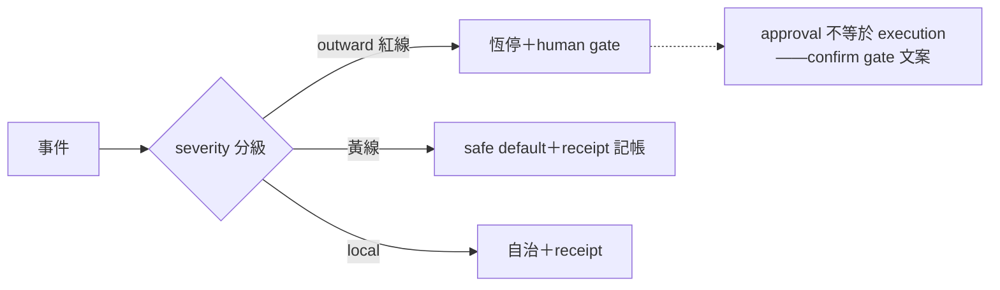

## Description

<!-- SECTION:DESCRIPTION:BEGIN -->
來源：cookbook r2 治理六面共識第五項（0925 晨間合議⑤——muse 腿第二名；判準＝outward 憲法級＋0924 授權語義真摩擦：quote-scope 判準的運維化）。

範圍候選：①sev 分級表（outward 紅黃線對齊 outward-action-consent）②approval 不是 execution 句式導入 confirm gate 文案③事故回覆 runbook 樣板（對應 debugging-and-error-recovery）。動 outward 面條文須走 instruction-writing 落地前審查閘。候補池入口非承諾排程。

## Acceptance Criteria
- [ ] #1 sev 分級表草案（對齊 outward-action-consent 紅黃線）
- [ ] #2 confirm gate 文案 approval 不是 execution 句式修訂（走審查閘）
- [ ] #3 runbook 樣板入 debugging skill（或另立）
<!-- SECTION:DESCRIPTION:END -->
