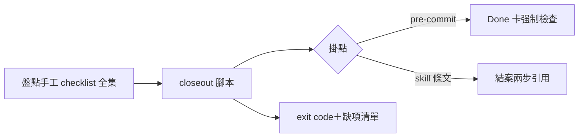
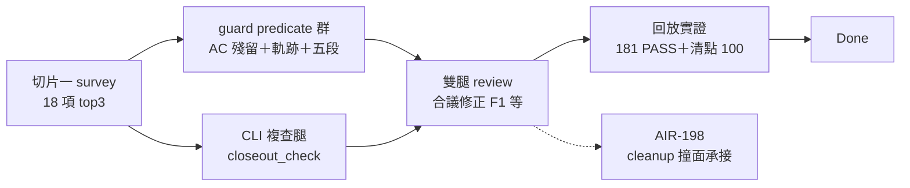

## Description

<!-- SECTION:DESCRIPTION:BEGIN -->
來源：0925 晨間合議⑥（兩腿一致）；手工結案 checklist 反覆摩擦（批量夜實證：AIR-181 結案漏 tick AC 七格、135.3 status 破口被 Intent Review 腿抓）。

範圍候選：①closeout 檢查腳本（AC 全勾？Final Summary mermaid 在場？sent-record 齊？status 一致？）②掛 pre-commit 或 kanban skill 流程③報告形態（exit code＋缺項清單）。先行偵察：盤點現行手工 checklist 全集（kanban 結案兩步＋commit skill 階段 2.9＋diagram guard）。

## Acceptance Criteria
- [ ] #1 手工 checklist 全集盤點落卡（單一源清單）
- [ ] #2 腳本實作＋對四張已關卡回放驗證（抓得到 181 式漏 tick）
- [ ] #3 掛點決策（hook vs skill 條文）經載體三判準
<!-- SECTION:DESCRIPTION:END -->

## Implementation Notes

<!-- SECTION:NOTES:BEGIN -->
【0925 切片一完成——手工 checklist 全集盤點】survey 全文＝.agent-tmp/air-193/survey.md（54 行；GLM-5.3 腿 job-mug3qitt）。核心發現：18 項手工檢查散 3 skill＋2 hook＋條文；僅 4 項已機械化（同 pre-commit guard）；**兩實證破口（181 漏 tick／135.3 status）都落在卡面結構 predicate 零 catcher 帶——與 guard 閘二觸發面重疊，擴充即可吸收（禁二刻，消費其判定）**。重複帶：In Progress 語義三處無共享 predicate。腳本化 top3 候選在 survey 表。

【0925 切片二結算——雙腿 review＋合議修正】①delivery：guard 結案 predicate 群（AC 殘留/status 軌跡/五段 marker/refs 警告）＋skip 分離（CARDCLOSE_STRUCT_SKIP fail-closed 逃生口）＋hooksPath 探針＋closeout_check.py CLI 複查腿（判定單一源 import guard）＋tests 37 條。②review 雙腿：muse（job-mug7cwq2，GO-WITH-FIXES，5 findings 1中4低）＋腿二 in-harness fresh code-reviewer（GO-WITH-FIXES，9 findings——codex 腿 job-mug7gzis 本地 ws 426 故障 deferred，N=7 補腿帳；依 instruction-writing 第 2 款 in-harness 雙 context 承接顯式降級）。③合議裁定：修 F1（AC fallback 行精確——雙腿獨立命中同一繞過縫）＋探針三分流＋CLI 人話錯誤/exit 收斂＋補測五條（fallback 殘留/全勾/精確標題繞過/wrong-value/無圖 baseline FS）；F2（guard×daily-cleanup 撞面，125 張 Done 100 FAIL 每晚擋 cleanup）＝開 AIR-198 承接；F4（探針跨 repo 誤報）/F6（drafts rename 訊息）/F7（豁免子字串過寬）/F9（CLI 薄封裝無專測）/flow 式 references 誤報＝記帳接受（零觸發或風險可控）。④回放實證：all-done 100 FAIL/25 PASS rc=100；air-181 現版 PASS（代勾驗證）；194/196/135.1 真實殘留浮出後已修補（FS BEGIN/AC 區塊/豁免標註）。⑤AC#3 掛點決策：hook 正典＋CLI 複查腿（載體三判準：機械 predicate＋確定性＋結案時點必在場）。⑥使用須知：closeout_check.py 須在 owning repo root 跑（root 相對路徑解析）。
<!-- SECTION:NOTES:END -->

## Final Summary

<!-- SECTION:FINAL_SUMMARY:BEGIN -->
**交付**：切片一盤點（18 項手工檢查＋top3）→切片二實作：guard 結案 predicate 群＋skip 分離＋hooksPath 探針＋closeout_check.py 複查腿＋37 tests。雙腿 review（muse＋in-harness；codex deferred ws 426）→合議修正（F1 繞過縫等）→回放驗證（181 抓取樣本＋全板清點）。後續腿＝AIR-198（cleanup 撞面）。

<!-- SECTION:FINAL_SUMMARY:END -->
