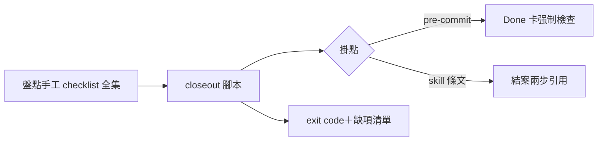

## Description

<!-- SECTION:DESCRIPTION:BEGIN -->
來源：0925 晨間合議⑥（兩腿一致）；手工結案 checklist 反覆摩擦（批量夜實證：AIR-181 結案漏 tick AC 七格、135.3 status 破口被 Intent Review 腿抓）。

範圍候選：①closeout 檢查腳本（AC 全勾？Final Summary mermaid 在場？sent-record 齊？status 一致？）②掛 pre-commit 或 kanban skill 流程③報告形態（exit code＋缺項清單）。先行偵察：盤點現行手工 checklist 全集（kanban 結案兩步＋commit skill 階段 2.9＋diagram guard）。

## Acceptance Criteria
- [ ] #1 手工 checklist 全集盤點落卡（單一源清單）
- [ ] #2 腳本實作＋對四張已關卡回放驗證（抓得到 181 式漏 tick）
- [ ] #3 掛點決策（hook vs skill 條文）經載體三判準
<!-- SECTION:DESCRIPTION:END -->

## Implementation Notes

<!-- SECTION:NOTES:BEGIN -->
【0925 切片一完成——手工 checklist 全集盤點】survey 全文＝.agent-tmp/air-193/survey.md（54 行；GLM-5.3 腿 job-mug3qitt）。核心發現：18 項手工檢查散 3 skill＋2 hook＋條文；僅 4 項已機械化（同 pre-commit guard）；**兩實證破口（181 漏 tick／135.3 status）都落在卡面結構 predicate 零 catcher 帶——與 guard 閘二觸發面重疊，擴充即可吸收（禁二刻，消費其判定）**。重複帶：In Progress 語義三處無共享 predicate。腳本化 top3 候選在 survey 表。
<!-- SECTION:NOTES:END -->
