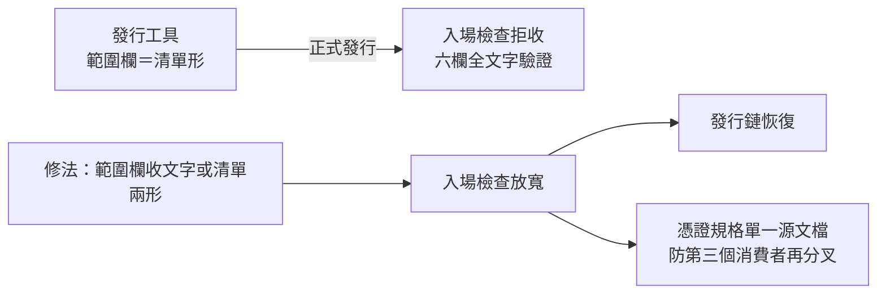

## Description

<!-- SECTION:DESCRIPTION:BEGIN -->
跨 repo 的派工憑證出現規格斷裂：發行工具開出的憑證（範圍欄是清單形）會被本 repo 的入場檢查拒收——入場檢查要求六欄全是文字，工具卻開出清單。後果：正式管道發的憑證過不了閘，只能手寫（而手寫格式沒文檔）。檢查工具自己也驗不出這件事（兩端深度不同）。

**修法（兩位審查者合議定案）**：①入場檢查的範圍欄放寬＝非空文字或非空清單（清單為正典——發行端語義說了算；文字向下相容；檢查只驗在場性不讀內容，放寬符合自家契約）②拒絕訊息去掉寫死的路徑＋附最小手寫憑證範例（補可發現性，不新增發行通道）③同卡立憑證規格單一源文檔（現在三處各說各話，防第三個消費者再分叉——兩位審查者一致）④發行工具端對稱修歸 SC 端裁決；重設計弧消費本 finding 為輸入、獨立小修先止血。

**修復落點**：hooks/＝控制面路徑——走本卡 branch＋pre-commit guard 照跑。

## Acceptance Criteria
- [ ] #1 範圍欄放寬：工具產憑證（清單形）過閘＋手寫文字憑證仍過（回兼容）
- [ ] #2 fail-loud 不回歸：空文字／空清單／混型清單／缺欄皆拒（兩形迴歸測試）
- [ ] #3 拒絕訊息：無過時路徑（通用措辭或 marker 推導）＋附最小手寫憑證範例
- [ ] #4 憑證規格單一源文檔落本 repo hook 側（工具端引用指針）——對稱修歸 SC 裁決
- [ ] #5 全量 hook 測試綠（control-plane guard 不受影響）

證據指針：合議兩腿＝bridge job muse/codex（0925）；finding 原信＝SC marshal 投 ai-guide-marshal 位址；patch 草案＝SC 信附（load_work_order 欄位驗證段）。
<!-- SECTION:DESCRIPTION:END -->
