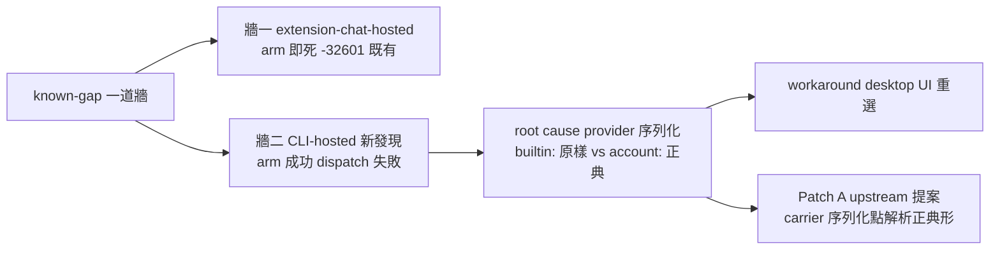
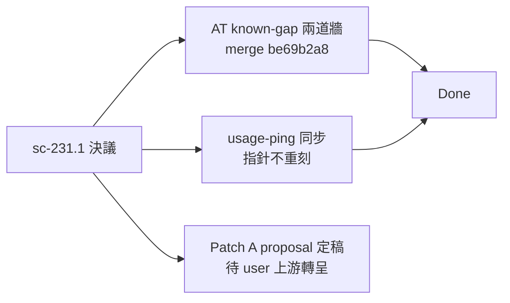

## Description

<!-- SECTION:DESCRIPTION:BEGIN -->
來源：SC sc-231.1 /at 模型牆 tri-discussion 決議（全證據 southchariot/.agent-tmp/at-model-wall/{BRIEF,CONVERGED-muse}.md）。

**D（無條件先行）——known-gap 更新**：skills/at＋usage-ping 的 known-gap 從一道牆改兩道：①extension-chat-hosted session：arm 即死 -32601（既有記載）②CLI-hosted session（新發現）：arm 成功但 desktop dispatch 失敗「Automation 模型选择不可用」——root cause＝CronCreate 把呼叫端 provider 視角 builtin:zai-coding-plan 原樣序列化，desktop dispatcher 只解析 account:zai-individual-coding-plan（automations 表 7 vs 1 對照實證，唯一差異 providerId 前綴；同 model 同 mode）。workaround＝desktop Automations UI 重選模型。

**A（upstream proposal 代轉 ZCode——Patch A 模式）**：carrier CronCreate 序列化點應把呼叫端 provider 視角解析成 registry canonical 形式（builtin:zai-coding-plan→account:zai-individual-coding-plan；映射知識＝carrier 自家 zcode-builtin.json providerRules 既有內容）。證據：registry 只列 account: 形式（builtin: 零出現）；7v1 對照；user 系統性痛點「程式化建的排程常要在 desktop 重選模型」。SC 約束聲明：不改 zcode、spawn-only、automations 表禁直寫——故只能提案。代轉＝起草 proposal 文檔交 user 上游通道（跨 repo 寫入恆停）。

## Acceptance Criteria
- [x] #1 skills/at known-gap 改兩道牆（SC 證據全文吸收；走 instruction-writing gate）
- [x] #2 usage-ping known-gap 同步
- [x] #3 Patch A upstream proposal 文檔定稿（交 user 上游通道）
<!-- SECTION:DESCRIPTION:END -->

## Implementation Notes

<!-- SECTION:NOTES:BEGIN -->
【0925 marshal seal——全綠 merge】①worker（glm flash job-mug6189q）交付：at/usage-ping 兩道牆＋patch-a-proposal.md（.agent-tmp/air-195/）。②marshal fresh-eyes：diff 全文審（gate 段未動、處置流程不變、純事實/workaround/驗證準據記載）＋drift rg 掃描（sc-231/一道牆/builtin: 引用僅兩檔皆已同步）。③回執四欄：classification=ordinary（事實記載更新；decision/authority/gate/authorization 條文零變更——「禁靜默降級」gate 原樣）；review=independent-context 腿（writer＝bridge spawn worker fresh context＋marshal diff 審＋drift 掃描）；session-freshness=fresh（skill 現況 Read 後改、SC 證據 BRIEF/CONVERGED-muse 全文路徑在 brief）；deployment-surfaces=healthy（merge 後 canonical 探針補錄）。④AC#3 proposal 定稿＝.agent-tmp/air-195/patch-a-proposal.md（英文一頁：Problem/Root cause/Evidence/Proposed change/Scope constraints），待 user 上游通道轉呈。

【0925 proposal 錨點升級（SC spec-mining 回饋併入）】patch-a-proposal.md 升級：Root cause 併四行級錨點；Proposed change 改 write 邊界（migrateLegacyModelProviderId 語義，zcodeAgentService ~2501 或 CLI 序列化點）＋read 邊界次選；未知 builtin:* fail-visible。已回執 SC（cebf26b4 直達 sess_d6e3e495）。另：契約三預設 user 裁決同意已記 135.5。附帶實測：codex/webgpt 帳號額度滿（10:36 AM 重置）——上游轉呈時機不受影響。

【0925 user 裁決——不上游】Patch A proposal 與牆一 carrier Patch 兩條修復路均不轉呈 upstream：proposal 說帖保留卡 WT .agent-tmp/air-195/patch-a-proposal.md（不轉呈、無遺留）；skills/at known-gap 出路節已更新為「出路已關閉——gap 轉永久已知限制，workaround 維持 desktop UI 建排程／UI 重選模型救回，carrier 自行修復前不重評」（merge canonical 探針過）。AC#1-#3 交付不變，本卡結案無新遺留。
<!-- SECTION:NOTES:END -->

## Final Summary

<!-- SECTION:FINAL_SUMMARY:BEGIN -->
**交付**：skills/at＋usage-ping known-gap 一道牆→兩道牆（merge be69b2a8）；Patch A upstream proposal 定稿（`.agent-tmp/air-195/patch-a-proposal.md`，待 user 上游通道轉呈 ZCode）。回執四欄齊（classification=ordinary／review=independent-context／freshness=fresh／deployment=healthy——canonical 探針 rg 實證）。

<!-- SECTION:FINAL_SUMMARY:END -->
