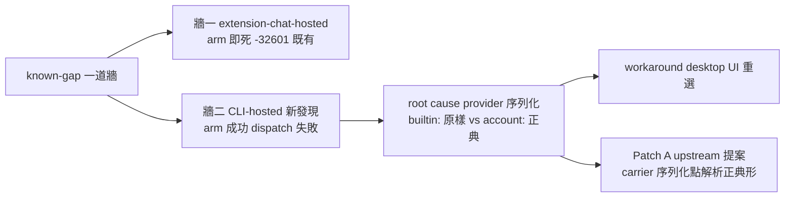

## Description

<!-- SECTION:DESCRIPTION:BEGIN -->
來源：SC sc-231.1 /at 模型牆 tri-discussion 決議（全證據 southchariot/.agent-tmp/at-model-wall/{BRIEF,CONVERGED-muse}.md）。

**D（無條件先行）——known-gap 更新**：skills/at＋usage-ping 的 known-gap 從一道牆改兩道：①extension-chat-hosted session：arm 即死 -32601（既有記載）②CLI-hosted session（新發現）：arm 成功但 desktop dispatch 失敗「Automation 模型选择不可用」——root cause＝CronCreate 把呼叫端 provider 視角 builtin:zai-coding-plan 原樣序列化，desktop dispatcher 只解析 account:zai-individual-coding-plan（automations 表 7 vs 1 對照實證，唯一差異 providerId 前綴；同 model 同 mode）。workaround＝desktop Automations UI 重選模型。

**A（upstream proposal 代轉 ZCode——Patch A 模式）**：carrier CronCreate 序列化點應把呼叫端 provider 視角解析成 registry canonical 形式（builtin:zai-coding-plan→account:zai-individual-coding-plan；映射知識＝carrier 自家 zcode-builtin.json providerRules 既有內容）。證據：registry 只列 account: 形式（builtin: 零出現）；7v1 對照；user 系統性痛點「程式化建的排程常要在 desktop 重選模型」。SC 約束聲明：不改 zcode、spawn-only、automations 表禁直寫——故只能提案。代轉＝起草 proposal 文檔交 user 上游通道（跨 repo 寫入恆停）。

## Acceptance Criteria
- [ ] #1 skills/at known-gap 改兩道牆（SC 證據全文吸收；走 instruction-writing gate）
- [ ] #2 usage-ping known-gap 同步
- [ ] #3 Patch A upstream proposal 文檔定稿（交 user 上游通道）
<!-- SECTION:DESCRIPTION:END -->
