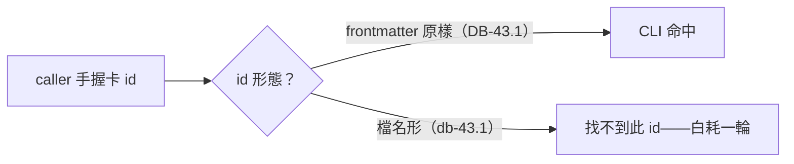

## Description

<!-- SECTION:DESCRIPTION:BEGIN -->
操作面摩擦（DB-43 弧兩次命中，0925 登記）：backlog CLI（backlog.md 1.50.1）task show/edit 對 id 精確匹配——卡檔名小寫（db-43.1）但 frontmatter id 大寫帶點（DB-43.1）；用檔名形 id 查詢得『找不到此 id』，白耗一輪排查。wt-open.sh 同型已修（91a8354f 放行 dot）。本卡＝kanban-board skill 卡編輯前查驗節補一條：id 操作一律用建卡 CLI 回報的 frontmatter 原樣（大小寫＋dot 敏感），檔名形≠id。低風險分類：操作指引（工具呼叫形態），非 authority/gate/authorization 語義變更——ordinary profile，一條獨立 context 腿。

<!-- SECTION:DESCRIPTION:END -->
