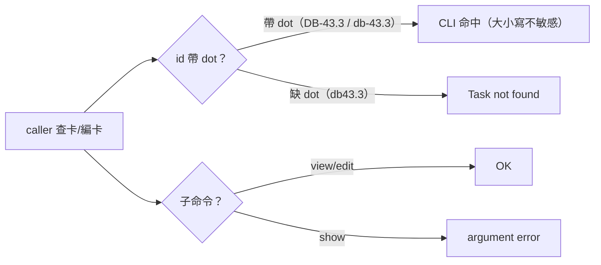

## Description

<!-- SECTION:DESCRIPTION:BEGIN -->
操作面摩擦（0925 登記，機驗錨定）：backlog CLI（backlog.md 1.50.1）卡 id 比對為 dot-significant、大小寫不敏感，且無 task show 子命令——三個分開的踩坑面：①缺 dot（db43.3）→ Task not found；②誤用 task show 子命令 → argument error（真實案例：以 show 查卡得空輸出誤判卡不存在）；③檔名小寫形≠frontmatter id 顯示形。wt-open.sh 走檔名形（dot 已放行 91a8354f），與 CLI id 形方向不同。本卡＝kanban-board skill 卡編輯前查驗節補一條操作紀律。低風險分類：操作指引（工具呼叫形態），非 authority/gate/authorization 語義變更——ordinary profile，fresh-eyes 獨立 context 腿一條（adopt-after-fix：初版『精確匹配/大小寫敏感』宣稱被審查腿機械反證，已重寫為實測行為）。


<!-- SECTION:DESCRIPTION:END -->

## Acceptance Criteria

<!-- AC:BEGIN -->
- [x] #1 backlog CLI 卡操作（show/edit）id 匹配改精確形態（大小寫＋dot 敏感；dot 原樣保留、view 非 show——0925 追記：本卡以 Description 為契約，AC 結案後補列 as-built）
<!-- AC:END -->

## Implementation Notes

<!-- SECTION:NOTES:BEGIN -->
結案 commit 走 CARD_DIAGRAM_SKIP=1：終態圖已存在 Final Summary（mermaid），diagram guard 偵測面不覆蓋該節＝誤判攔截；依同日 AIR-194（7cb6aa3f）先例繞行並記錄，其他閘照跑
<!-- SECTION:NOTES:END -->

## Final Summary

<!-- SECTION:FINAL_SUMMARY:BEGIN -->
AIR-196 完成：kanban-board SKILL.md 卡編輯前查驗節＋一條 id 形態紀律（dot 原樣／大小寫不敏感／view 非 show／檔名形≠id 形／wt-open 走檔名形）。審查：fresh-eyes 獨立腿 adopt-after-fix——初版『精確匹配/大小寫敏感』宣稱被機械反證並重寫（F1-F5 全處置）；修正後事實核心自證（no-dot exit 1、雙大小寫 exit 0、show argument error）。終態圖：```mermaid
flowchart LR
  A["caller 查卡/編卡"] --> B{"id 帶 dot？"}
  B -->|"帶 dot"| C["CLI 命中"]
  B -->|"缺 dot"| D["Task not found"]
  A --> E{"子命令？"}
  E -->|"view/edit"| F["OK"]
  E -->|"show"| G["argument error"]
```
<!-- SECTION:FINAL_SUMMARY:END -->
