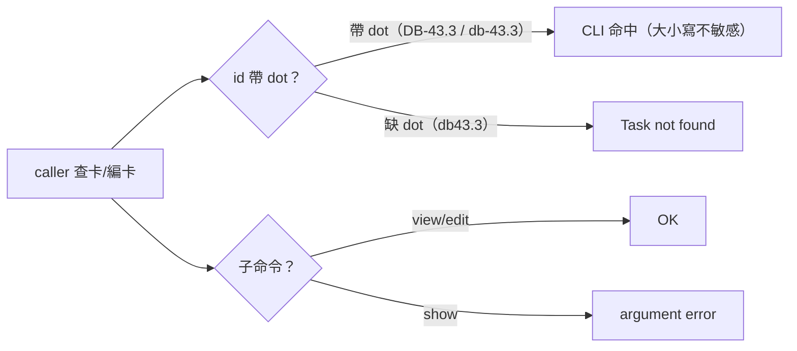

## Description

<!-- SECTION:DESCRIPTION:BEGIN -->
操作面摩擦（0925 登記，機驗錨定）：backlog CLI（backlog.md 1.50.1）卡 id 比對為 dot-significant、大小寫不敏感，且無 task show 子命令——三個分開的踩坑面：①缺 dot（db43.3）→ Task not found；②誤用 task show 子命令 → argument error（真實案例：以 show 查卡得空輸出誤判卡不存在）；③檔名小寫形≠frontmatter id 顯示形。wt-open.sh 走檔名形（dot 已放行 91a8354f），與 CLI id 形方向不同。本卡＝kanban-board skill 卡編輯前查驗節補一條操作紀律。低風險分類：操作指引（工具呼叫形態），非 authority/gate/authorization 語義變更——ordinary profile，fresh-eyes 獨立 context 腿一條（adopt-after-fix：初版『精確匹配/大小寫敏感』宣稱被審查腿機械反證，已重寫為實測行為）。

<!-- SECTION:DESCRIPTION:END -->
