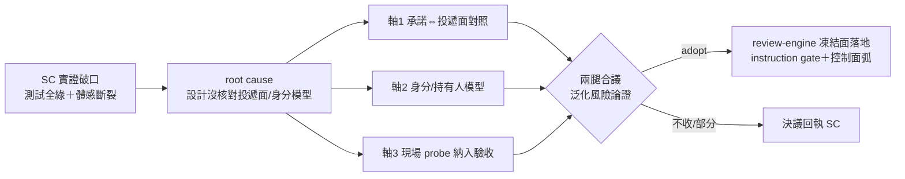

## Description

<!-- SECTION:DESCRIPTION:BEGIN -->
來源＝SC 回信（envelope 355c94cf，0925）架構研究產出附帶提案。SC 端本次「測試全綠但 user 體感斷裂」（位址 binding null＝信停滯留佇列）的結構性根因＝設計沒核對投遞面/身分模型。SC 建議 review-engine 凍結三條設計審查軸：(1) 承諾⇔投遞面對照——每個 UI 可見性承諾點名 authority 讀面＋列出同名不同面的兄弟 (2) 身分/持有人模型——凡涉位址/mailbox/ext 身分必問 holder 是誰、lease 幾何、衝突誰 fail-loud (3) 現場 probe 納入驗收——pending/address ls/registry ro 與單元測試同列證據。全文＝southchariot/.agent-tmp/drawer-arch-research/CONVERGED-muse.md RQ3。性質＝候補評估：軸本身是 scbus 領域教訓，是否升格為 review-engine 通則（跨專案審查方法論）須防過度泛化——先合議再動控制面。

<!-- SECTION:DESCRIPTION:END -->

## Acceptance Criteria
<!-- AC:BEGIN -->
- [ ] #1 兩腿合議評估三軸 adopt/改寫/不收（過度泛化風險顯式論證：scbus 教訓→通則的映射條件）
- [ ] #2 若 adopt：review-engine skill 凍結面落地（instruction gate＋控制面弧＋merge 前回執四欄）
- [ ] #3 若不收或部分收：決議回執 SC（經 scbus）
<!-- AC:END -->
