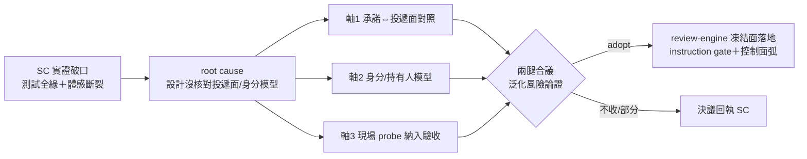
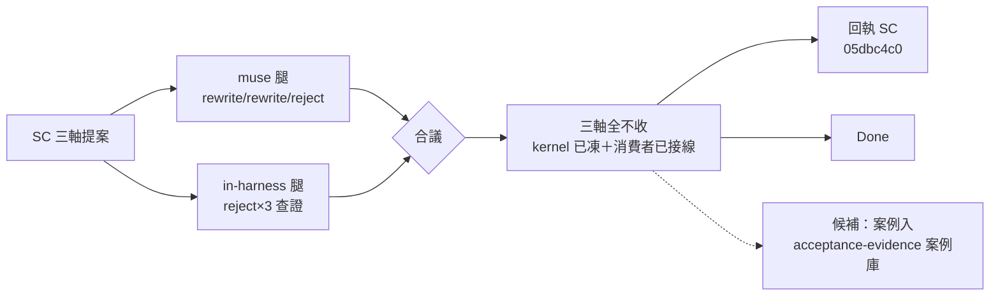

## Description

<!-- SECTION:DESCRIPTION:BEGIN -->
來源＝SC 回信（envelope 355c94cf，0925）架構研究產出附帶提案。SC 端本次「測試全綠但 user 體感斷裂」（位址 binding null＝信停滯留佇列）的結構性根因＝設計沒核對投遞面/身分模型。SC 建議 review-engine 凍結三條設計審查軸：(1) 承諾⇔投遞面對照——每個 UI 可見性承諾點名 authority 讀面＋列出同名不同面的兄弟 (2) 身分/持有人模型——凡涉位址/mailbox/ext 身分必問 holder 是誰、lease 幾何、衝突誰 fail-loud (3) 現場 probe 納入驗收——pending/address ls/registry ro 與單元測試同列證據。全文＝southchariot/.agent-tmp/drawer-arch-research/CONVERGED-muse.md RQ3。性質＝候補評估：軸本身是 scbus 領域教訓，是否升格為 review-engine 通則（跨專案審查方法論）須防過度泛化——先合議再動控制面。

<!-- SECTION:DESCRIPTION:END -->

## Acceptance Criteria
<!-- AC:BEGIN -->
- [x] #1 兩腿合議評估三軸 adopt/改寫/不收（過度泛化風險顯式論證：scbus 教訓→通則的映射條件）
- [x] #2 若 adopt：review-engine skill 凍結面落地（instruction gate＋控制面弧＋merge 前回執四欄）——N/A：裁定三軸全不收，條件不觸發（0925 合議）
- [x] #3 若不收或部分收：決議回執 SC（經 scbus）——已送達（message 05dbc4c0，queue 直達 sess_d6e3e495）
<!-- AC:END -->

## Implementation Notes

<!-- SECTION:NOTES:BEGIN -->
【0925 雙腿合議裁定——三軸全不收（reject×3）】①雙腿：muse（job-mugadij9 rewrite/rewrite/reject）＋in-harness fresh code-reviewer（codex ws 426 二連敗 deferred，承接腿 reject/reject/reject）。②合議收斂：muse 的 rewrite 是條件式（若收則凍 bridge-dispatch/arch-thinking 觸發表），腿二逐檔查證證明那些位置已以更強形式凍結且消費者已接線——AIR-168 governance/scbus-address-contract §0-1/§8＝軸2（holder/lease/fencing/CAS/對抗案例）嚴格超集；handoff Phase 5（receipt≠ACK 禁互升格）＋AIR-168 §2/3（三態投遞）＝軸1 kernel；acceptance-evidence（L1-L6/綠燈只證自洽/oracle 分級）＋validation-strategy（e2e 優先/mock 循環論證）＝軸3 全覆蓋。③根本裁定：scbus 事故根因＝既有條文（design-thinking 間接消費者追蹤）未被執行，非條文缺口——收通則版違 review-engine 收進判準（非全命令適用）＋single-source drift 防護（第二定義源）。④腿二可選建議（marshal 裁量）：scbus 案例以 case 非判準補進 acceptance-evidence skill 案例庫——列候補不即做（YAGNI，bundle 零 bytes 但本卡範圍外）。⑤AC#2 不觸發（不 adopt）；AC#3 回執 SC 已送達（message 05dbc4c0，queue 直達）。
<!-- SECTION:NOTES:END -->

## Final Summary

<!-- SECTION:FINAL_SUMMARY:BEGIN -->
**裁定**：三軸全不收 ai-guide 通則（reject×3，雙腿合議：muse rewrite/rewrite/reject 條件式＋in-harness reject/reject/reject 查證——條件位置已由 AIR-168 scbus-address-contract＋handoff Phase 5＋acceptance-evidence/validation-strategy 以更強形式凍結且消費者已接線）。事故根因＝既有條文未執行，非條文缺口。決議已回執 SC（05dbc4c0）。候補遺留：scbus 案例（case 非判準）入 acceptance-evidence 案例庫。

<!-- SECTION:FINAL_SUMMARY:END -->
