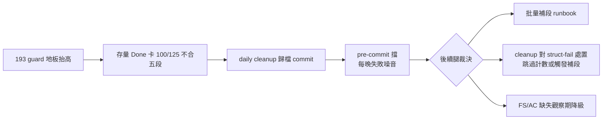

## Description

<!-- SECTION:DESCRIPTION:BEGIN -->
來源＝AIR-193 切片二雙腿 review 腿二 F2（confirmed，機械重現）：結案結構 predicate 上線後（0925），deploy/scripts/run-backlog-cleanup.sh 的每日歸檔批次（tasks→completed，R code、is_entry=False、status 仍 Done）照跑結構 predicate——全板 125 張 Done 卡 100 張 FAIL（AC 殘留 63／AC 缺段無 fallback 標題 34／FS marker 缺 16／DESCRIPTION 缺 1／malformed 4），cleanup 批次 commit 逐卡被 pre-commit 擋：腳本 loud fail 但無補齊腿，每晚重複失敗噪音＋清理實質停擺。

需求釐清：①存量 100 張是補格式（批量補段）還是觀察期豁免 ②cleanup 腳本要不要對 struct-fail 有機械處置（跳過＋計數入 log？觸發補段清單？）③選項互斥或組合。裁定面＝載體三判準（cleanup 是 hook 消費端，guard 是正典判定——禁二刻，cleanup 端只消費 exit code）。

<!-- SECTION:DESCRIPTION:END -->

## Acceptance Criteria
<!-- AC:BEGIN -->
- [x] #1 裁定三選一（或組合）記卡 notes（補段 runbook／cleanup 處置／觀察期降級）
- [ ] #2 實作落地＋cleanup 批次連續三晚綠燈（或顯式豁免清單機制）
- [x] #3 存量 100 張清零或歸檔面隔離（判準記 notes）
<!-- AC:END -->

## Implementation Notes

<!-- SECTION:NOTES:BEGIN -->
【0925 裁定＋實作落地（lane 可決——選項組合 G＋輕量補段路徑）】①裁定：批次 commit 前跑 closeout_check 前置過濾（判定單一源＝guard 經複查腿消費，禁二刻）——結構 FAIL 卡跳過歸檔＋[待補段-跳過] 訊息（含缺項清單）＋struct_skip 計數入 summary；fail-closed 保持（不降級、不觀察期），補段後次日自動重試。②實作：run-backlog-cleanup.sh +10 行（候選迴圈內 precheck PASS 後過濾；CLOSEOUT_CHECK 缺場 loud 預檢；bash 3.2 變數邊界修正）。③驗證：tmp repo 冒煙——結構 FAIL 卡正確被擋（訊息列缺項）、PASS 卡走到 complete 步、summary 乾淨；bash -n 綠。merge 644a0286。④AC 帳：#1 ✓（本 notes 即裁定）；#3 ✓（隔離機制＝待補清單留存 tasks/，漸進消化）；#2 部分——機制落地＋冒煙綠，『連續三晚綠燈』須 launchd 自然驗證（明起 23:50），餘兩晚綠燈後結案。⑤twin 提醒：mosaic_alpha/deploy/scripts/ 同邏輯副本——跨 repo 同步歸 mosaic 線（本端不動）。
<!-- SECTION:NOTES:END -->
