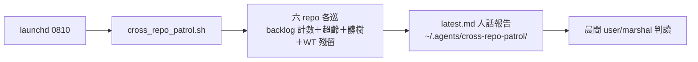
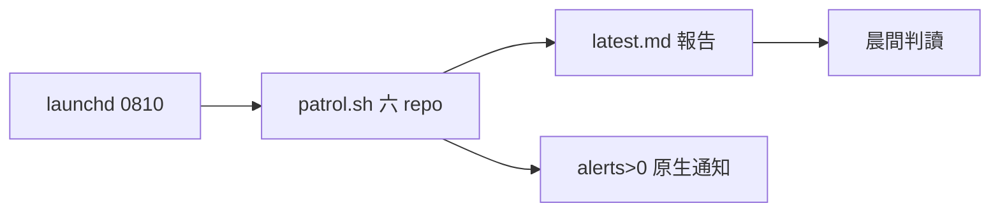

## Description

<!-- SECTION:DESCRIPTION:BEGIN -->
來源＝0925 user 提案（sweep 落地後追問「要不要定時收集所有重要 repo 看哪些該處理沒處理」；memory spine 方案已否——瞬時狀態非知識，spine 契約禁任務流水）。範圍 user 確認＝ai-guide＋mosaic_alpha（非 mosaic）＋southchariot＋delegate-bridge＋code-reality＋sc-router 六 repo。

設計：瞬時報告寫固定路徑不進 memory；判定與處置分離（報告不動手）；code-reality 無 backlog 面只巡 git 面；缺 repo loud 記一行不擋其他。
<!-- SECTION:DESCRIPTION:END -->

## Acceptance Criteria
<!-- AC:BEGIN -->
- [x] #1 腳本＋plist 落地＋全六 repo 實跑一次出報告
- [x] #2 報告含 per-repo：To Do/In Progress 計數、超齡 To Do（>30d）、髒樹、WT 殘留
- [x] #3 安裝 launchd 0810＋kickstart 驗證
<!-- AC:END -->

## Final Summary

<!-- SECTION:FINAL_SUMMARY:BEGIN -->
**交付**：scripts/cross_repo_patrol.sh（六 repo 唯讀巡檢：backlog To Do/IP 計數＋超齡 To Do>30d＋髒樹＋WT/branch 殘留；alerts>0 發 macOS 原生通知）＋launchd 08:10 排程（已安裝＋kickstart exit 0 驗證）。首跑報告：mosaic_alpha 9 To Do 為最大訊號。設計：瞬時報告寫 ~/.agents/cross-repo-patrol/latest.md 不進 memory spine（契約禁任務流水）；偵測與處置分離。

<!-- SECTION:FINAL_SUMMARY:END -->
