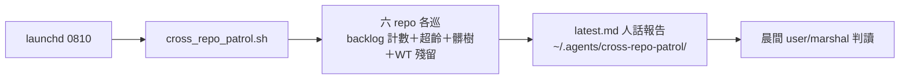
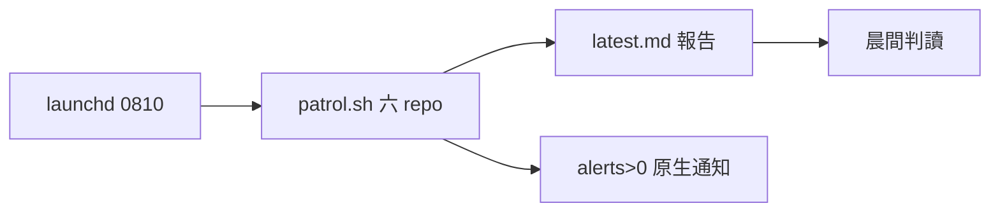

## Description

<!-- SECTION:DESCRIPTION:BEGIN -->
來源＝0925 user 提案（sweep 落地後追問「要不要定時收集所有重要 repo 看哪些該處理沒處理」；memory spine 方案已否——瞬時狀態非知識，spine 契約禁任務流水）。範圍 user 確認＝ai-guide＋mosaic_alpha（非 mosaic）＋southchariot＋delegate-bridge＋code-reality＋sc-router 六 repo。

```mermaid
flowchart LR
  A[launchd 0810] --> B[cross_repo_patrol.sh]
  B --> C[六 repo 各巡<br/>backlog 計數＋超齡＋髒樹＋WT 殘留]
  C --> D[latest.md 人話報告<br/>~/.agents/cross-repo-patrol/]
  D --> E[晨間 user/marshal 判讀]
```

設計：瞬時報告寫固定路徑不進 memory；判定與處置分離（報告不動手）；code-reality 無 backlog 面只巡 git 面；缺 repo loud 記一行不擋其他。
<!-- SECTION:DESCRIPTION:END -->

## Acceptance Criteria
<!-- AC:BEGIN -->
- [x] #1 腳本＋plist 落地＋全六 repo 實跑一次出報告
- [x] #2 報告含 per-repo：To Do/In Progress 計數、超齡 To Do（>30d）、髒樹、WT 殘留
- [x] #3 安裝 launchd 0810＋kickstart 驗證
<!-- AC:END -->

## Implementation Notes

<!-- SECTION:NOTES:BEGIN -->
【0925 補審修正（跳過 review 的洞由補腿收回——GO-WITH-FIXES）】F1 Critical：WT 殘留偵測 awk 雙缺陷（比較永不成立＋找不到 path 當無殘留）＝永久 no-op——今晨報告全 0 為假綠燈；重寫兩段式（porcelain 建 branch→dir 映射＋反轉判定），修後實跑 southchariot 抓到 1 殘留（alerts=1 假綠燈解除）。F2：branch 前綴表參數化（六 repo 全蓋——原 air-*只蓋 1/6）。F3：osascript 失敗落 stderr 進 err log（漏報向量封）。F4：超齡嚴格 >30d。F5 cosmetic／F6 髒樹不通知＝設計選擇（腳本頭註解已明）——記帳。補審腿＝199 跳過 review 的洞收回。
<!-- SECTION:NOTES:END -->

## Final Summary

<!-- SECTION:FINAL_SUMMARY:BEGIN -->
**交付**：scripts/cross_repo_patrol.sh（六 repo 唯讀巡檢：backlog To Do/IP 計數＋超齡 To Do>30d＋髒樹＋WT/branch 殘留；alerts>0 發 macOS 原生通知）＋launchd 08:10 排程（已安裝＋kickstart exit 0 驗證）。首跑報告：mosaic_alpha 9 To Do 為最大訊號。設計：瞬時報告寫 ~/.agents/cross-repo-patrol/latest.md 不進 memory spine（契約禁任務流水）；偵測與處置分離。

```mermaid
flowchart LR
  A[launchd 0810] --> B[patrol.sh 六 repo]
  B --> C[latest.md 報告]
  B --> D[alerts>0 原生通知]
  C --> E[晨間判讀]
```
<!-- SECTION:FINAL_SUMMARY:END -->
