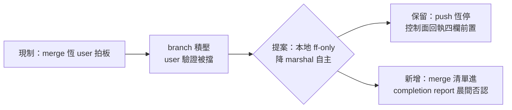
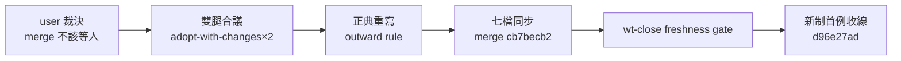

## Description

<!-- SECTION:DESCRIPTION:BEGIN -->
來源＝0925 user 原話：『為何現在一堆做完 post-build commit 之後不合併回main在等我？有必要嗎？……改成 wt/branch 要合併回 main 我才能驗證』。現制＝trunk merge（ff-only）恆 user 拍板（結案拍板點）；動機＝user 驗證對象是 main 上的產物，branch 積壓＝驗證被自己制度擋住。本地 ff-only merge 是可逆 git 操作（revert 帽涵蓋），push 恆停不變——門檻不對稱：commit 已委任（receipt gate）、merge 反而等人的原因只有歷史（結案拍板語義），非風險。

單一源五處（rg 已掃）：AGENTS.md 收尾條＋WT 過渡條款／commit skill:196＋2.9／deep-work Settle 條款 5／outward rule Commit 專屬段（指向 commit skill）／wt-close.sh docstring。合議後依裁定修改。
<!-- SECTION:DESCRIPTION:END -->

## Acceptance Criteria
<!-- AC:BEGIN -->
- [x] #1 muse+codex 雙腿合議裁定放寬邊界（哪些場景保留 gate、晨間否認機制形態）——adopt-with-changes×2 高度收斂
- [x] #2 依裁定修改五處單一源（instruction gate：控制面弧＋回執四欄）——實作七檔（merge cb7becb2）
- [x] #3 autonomous-execution/deep-work 批量條款同步（紅線表 git commit 行不動——codex 裁定免誤升 redline；deep-work 三處已改）
<!-- AC:END -->

## Implementation Notes

<!-- SECTION:NOTES:BEGIN -->
【0925 雙腿合議＋實作落地（新制首例：本弧即用新制收線）】①雙腿：muse（job-mugjn2ia adopt-with-changes）＋codex（job-mugjn2ki adopt-with-changes）——高度收斂。②合議裁定：本地 ff-only merge＝marshal 自主（session-agnostic predicate delegation）；前置四件＝fresh receipt（rebase 即失效須重驗）＋ff-only＋控制面 landing eligible＋merge 後 canonical-only surface 輕量 probe；不新增 main 全量測試 gate（ff-only 零新 tree）；git 收線拍板移轉 marshal、卡 Done 翻牌拍板仍 user（新語序 commit→merge→main 驗證→Done）；merge 後 main 崩＝marshal 立即 revert＋揭露＋依賴傳播；晨間否決→revert 對象延伸含 merge；push/deploy/跨 repo 恆停；autonomous 紅線表不動（codex 論證：merge 本非紅線，免誤升）。③實作七檔：outward rule:43 正典邊界宣告重寫／commit skill:196＋2.9（landing eligible/blocked verdict）／deep-work 90/236/245／AGENTS.md 收尾條＋WT 過渡／wt-close.sh（docstring＋runtime 文案＋receipt freshness gate 實質 enforcement——head_sha mismatch die）／blueprint workflow.md:37／rebase skill pointer 條 5。④驗證：殘留 rg 零命中；wt-close 29 tests＋全量綠；bash 3.2 全形括號咬變數名二犯（RECEIPT_FILE）brace 化修正；新制首例＝本弧 commit→merge（marshal 自主）→receipt-fresh gate→收線→現在翻 Done。⑤AIR-183 歷史卡不改，本卡 supersede。
<!-- SECTION:NOTES:END -->

## Final Summary

<!-- SECTION:FINAL_SUMMARY:BEGIN -->
**新制（AIR-200）**：本地 ff-only trunk merge＝marshal 自主（fresh receipt＋ff-only＋landing eligible＋canonical probe 四前置；rebase 即 receipt 失效重驗；merge 後 main 崩＝marshal 立即 revert；晨間否決→revert 延伸含 merge；push 恆停；卡 Done 翻牌仍 user——新語序 commit→merge→main 驗證→Done）。正典＝outward rule「Commit 專屬段」邊界宣告；wt-close.sh 帶 receipt freshness gate（mechanical enforcement）。本弧即新制首例收線（d96e27ad）。supersede AIR-183 三層邊界。

<!-- SECTION:FINAL_SUMMARY:END -->
