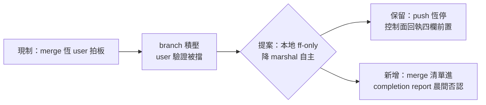

## Description

<!-- SECTION:DESCRIPTION:BEGIN -->
來源＝0925 user 原話：『為何現在一堆做完 post-build commit 之後不合併回main在等我？有必要嗎？……改成 wt/branch 要合併回 main 我才能驗證』。現制＝trunk merge（ff-only）恆 user 拍板（結案拍板點）；動機＝user 驗證對象是 main 上的產物，branch 積壓＝驗證被自己制度擋住。本地 ff-only merge 是可逆 git 操作（revert 帽涵蓋），push 恆停不變——門檻不對稱：commit 已委任（receipt gate）、merge 反而等人的原因只有歷史（結案拍板語義），非風險。

單一源五處（rg 已掃）：AGENTS.md 收尾條＋WT 過渡條款／commit skill:196＋2.9／deep-work Settle 條款 5／outward rule Commit 專屬段（指向 commit skill）／wt-close.sh docstring。合議後依裁定修改。
<!-- SECTION:DESCRIPTION:END -->

## Acceptance Criteria
<!-- AC:BEGIN -->
- [ ] #1 muse+codex 雙腿合議裁定放寬邊界（哪些場景保留 gate、晨間否認機制形態）
- [ ] #2 依裁定修改五處單一源（instruction gate：控制面弧＋回執四欄）
- [ ] #3 autonomous-execution/deep-work 批量條款同步（紅線表 git commit 行不動）
<!-- AC:END -->
