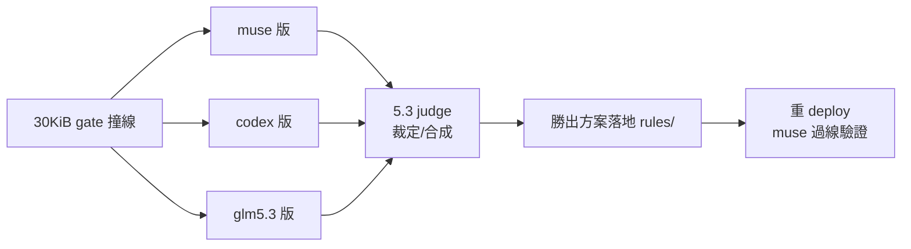

## Description

<!-- SECTION:DESCRIPTION:BEGIN -->
來源＝0925 AIR-192 落地後 muse bundle 撞 30KiB gate（30,965B > 30,720 gate；實際截斷線 32,000B 前僅 1,035B 餘裕；deploy [FAIL] 拒寫 muse 面已手動同步）。晨間合議⑥『瘦身延後撞線再說』——現在撞線。user 裁決形態＝muse/codex/glm5.3 三家族各寫一版瘦身修訂，5.3 judge 裁定勝出/合成。

手段正典（rules/AGENTS.md size-gate note＋memory-audit 載體表）：demote on-demand 內容至 reference skill（rule 留 always-on 核心＋pointer）——禁刪知識、禁升 hook。目標：新 bundle ≤30,700B（gate 內）且知識零損失（demote 有指針可達）。
<!-- SECTION:DESCRIPTION:END -->

## Acceptance Criteria
<!-- AC:BEGIN -->
- [ ] #1 三家族瘦身修訂版各一（逐 rule 處置表＋預估 bytes＋風險）
- [ ] #2 5.3 judge 裁定勝出/合成方案＋理由
- [ ] #3 勝出方案落地 rules/＋重 deploy muse 面 ≤30,700B＋三面內容探針
<!-- AC:END -->
